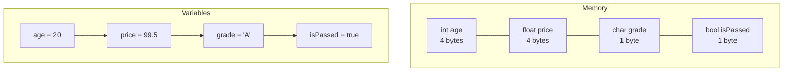

# Variables in C++

## Navigation

- Previous: —
- Next: [If / Else](02-if-else.md)
- Task: [Task 1 - Variables](../tasks/task1-variables.md)

---

##  What is a Variable?

A variable is a container used to store data in memory.  
Each variable represents a specific value that can be used and modified during program execution.

Every variable has:

- Name → identifier
- Type → kind of data
- Value → stored data

---

##  Why Do We Use Variables?

- To store and reuse values
- To make programs dynamic
- To improve code readability

---

##  Data Types in C++

| Type   | Description             | Example   |
| ------ | ----------------------- | --------- |
| int    | Integer numbers         | 10        |
| float  | Decimal numbers         | 5.5       |
| double | High precision decimals | 10.123456 |
| char   | Single character        | 'A'       |
| bool   | True / False            | true      |
| string | Text                    | "Hello"   |

## Visualization



---

##  Variable Declaration

```cpp
int age = 20;
float price = 99.5;
char grade = 'A';
bool isPassed = true;
string name = "Mohamed";
```

---

## Naming Rules

- Must start with a letter or underscore `_`
- Cannot start with a number ❌
- No spaces allowed ❌
- Case-sensitive

### ✔ Valid names

```cpp
int age;
float totalPrice;
```

### ❌ Invalid names

```cpp
int 1age;
float total price;
```

---

##  Common Mistakes

- Using variable before declaring it
- Wrong data type
- Forgetting semicolon `;`

---

##  Tips

```cpp
const float PI = 3.14;
```

---

##  Input and Output

```cpp
int age;
cin >> age;

cout << age;
```

---

## Example

```cpp
#include <iostream>
using namespace std;

int main() {
    int age;
    cout << "Enter age: ";
    cin >> age;
    cout << age;
    return 0;
}
```

---

## Practice

- Declare variables and print them
- Take input and print it
- Store age and salary

---

## Summary

- Variables store data
- Each variable has type, name, value
- Must follow naming rules

---

##  Apply What You Learned

Go to → [Task 1: Variables](../tasks/task1-variables.md)
