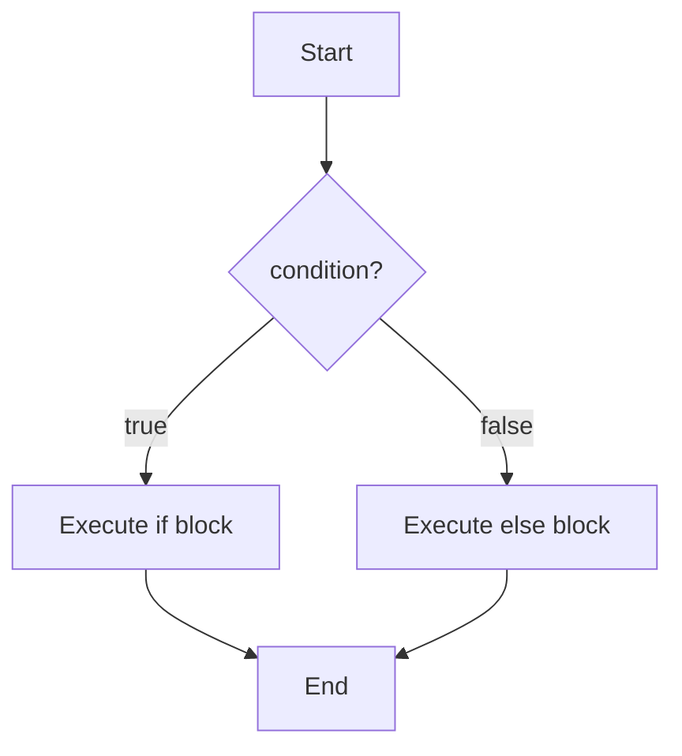
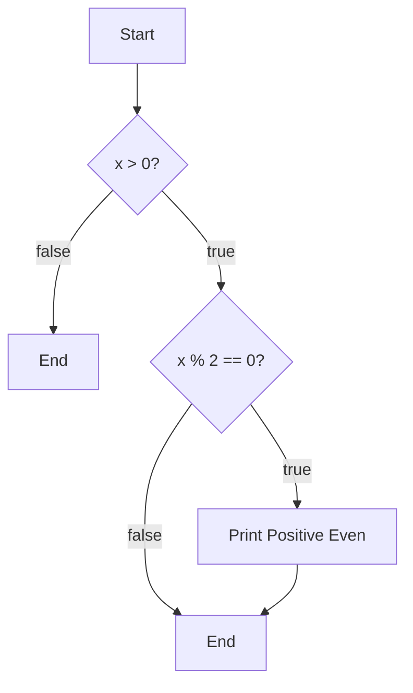

# If / Else in C++

## Navigation

- Previous: [Variables](01-variables.md)
- Next: [Loops](03-loops.md)
- Task: [Task 2 - If / Else](../tasks/task2-if.md)

---

##  What is If / Else?

Used to make decisions in your program.

---

##  Basic Syntax

```cpp
if(condition){
    // code
}else{
    // code
}
```

## Visualization



---

##  Example

```cpp
int x = 10;

if(x > 5){
    cout << "Greater";
}else{
    cout << "Smaller";
}
```

---

##  Comparison Operators

| Operator | Meaning          |
| -------- | ---------------- |
| >        | greater than     |
| <        | less than        |
| ==       | equal            |
| !=       | not equal        |
| >=       | greater or equal |
| <=       | less or equal    |

---

##  Nested If

```cpp
int x = 10;

if(x > 0){
    if(x % 2 == 0){
        cout << "Positive Even";
    }
}
```

## Visualization



---

##  Common Mistakes

- Using `=` instead of `==` ❌
- Forgetting `{}`
- Wrong condition

---

##  Tips

- Keep conditions simple
- Use indentation for readability

---

##  Input Example

```cpp
int num;
cin >> num;

if(num % 2 == 0){
    cout << "Even";
}else{
    cout << "Odd";
}
```

---

## Full Example

```cpp
#include <iostream>
using namespace std;

int main() {
    int num;
    cout << "Enter number: ";
    cin >> num;

    if(num > 0){
        cout << "Positive";
    }else{
        cout << "Negative or Zero";
    }

    return 0;
}
```

---

## Practice

###  Easy

- Check if number is even or odd

###  Medium

- Check if number is positive or negative

###  Challenge

- Find the largest of 3 numbers

---

## Summary

- if / else used for decision making
- conditions must return true or false
- supports nested conditions

---

##  Next Step

Go to → `03-loops.md`

---

##  Apply What You Learned

Go to → [Task 2: If](../tasks/task2-if.md)
