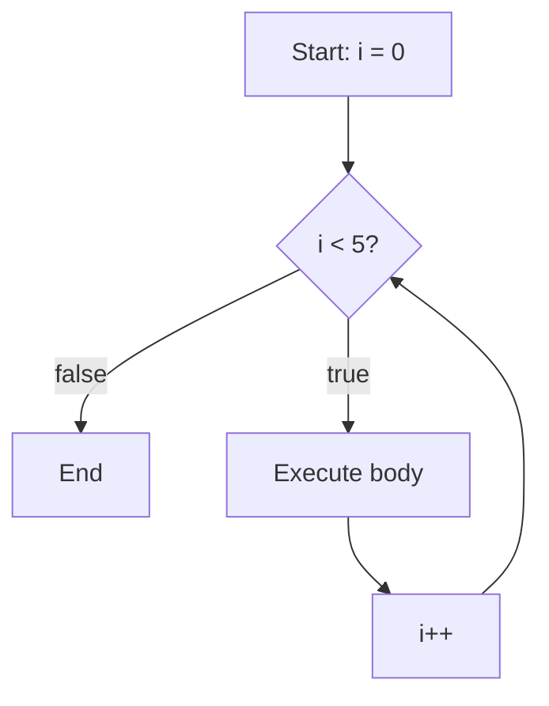
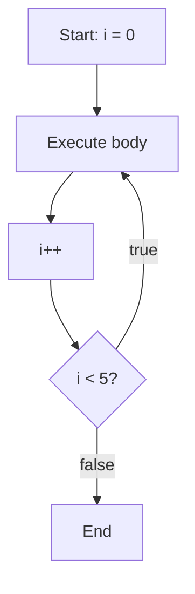

# Loops in C++

## Navigation

- Previous: [If / Else](02-if-else.md)
- Next: [Arrays](04-arrays.md)
- Task: [Task 3 - Loops](../tasks/task3-loops.md)

---

##  What is a Loop?

A loop is used to repeat a block of code multiple times.

---

##  for Loop

Used when the number of iterations is known.

```cpp
for(int i = 0; i < 5; i++){
    cout << i << endl;
}
```

### شرح:

- `i = 0` → بداية
- `i < 5` → شرط التكرار
- `i++` → زيادة كل مرة

## Visualization



---

##  while Loop

Used when the number of iterations is not known.

```cpp
int i = 0;

while(i < 5){
    cout << i << endl;
    i++;
}
```

## Visualization


---

##  do-while Loop

Executes at least once.

```cpp
int i = 0;

do{
    cout << i << endl;
    i++;
}while(i < 5);
```

## Visualization



---

##  Loop Control

### break

Stops the loop completely.

```cpp
for(int i = 0; i < 10; i++){
    if(i == 5){
        break;
    }
    cout << i;
}
```

### continue

Skips current iteration.

```cpp
for(int i = 0; i < 5; i++){
    if(i == 2){
        continue;
    }
    cout << i;
}
```

---

##  Common Mistakes

- Infinite loop ❌
- Forgetting increment ❌

---

##  Tips

- Use `for` when you know the number of iterations
- Use `while` for conditions

---

##  Example

```cpp
int n;
cin >> n;

for(int i = 1; i <= n; i++){
    cout << i << endl;
}
```

---

## Full Example

```cpp
#include <iostream>
using namespace std;

int main() {
    int n;
    cout << "Enter number: ";
    cin >> n;

    int sum = 0;

    for(int i = 1; i <= n; i++){
        sum += i;
    }

    cout << "Sum = " << sum;

    return 0;
}
```

---

## Practice

###  Easy

- Print numbers from 1 to 100

###  Medium

- Print even numbers
- Calculate factorial

###  Challenge

- Print pyramid pattern

---

## Summary

- Loops repeat code
- 3 types: for, while, do-while
- break stops loop
- continue skips iteration

---

##  Next Step

Go to → `04-arrays.md`

---

##  Apply What You Learned

Go to → [Task 3: Loops](../tasks/task3-loops.md)
