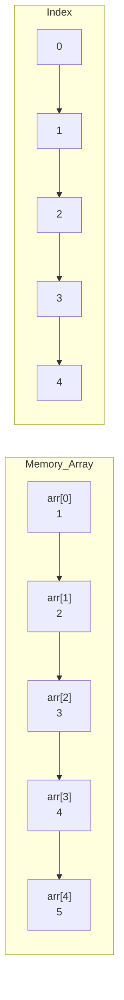

# Arrays in C++

## Navigation

- Previous: [Loops](03-loops.md)
- Next: [Functions](05-functions.md)
- Task: [Task 4 - Arrays](../tasks/task4-arrays.md)

---

##  What is an Array?

An array is a collection of elements of the same data type stored in contiguous memory.

---

##  Why use arrays?

- Store multiple values in one variable
- Easy to loop through
- Organized data

---

##  Syntax

```cpp
int arr[5] = {1, 2, 3, 4, 5};
```

## Visualization



---

##  Access Elements

Array index starts from 0.

```cpp
cout << arr[0]; // first element
cout << arr[4]; // last element
```

## Visualization

```mermaid
flowchart LR
    subgraph Array
        A["Index 0<br/>Value: 1"] --> B["Index 1<br/>Value: 2"] --> C["Index 2<br/>Value: 3"] --> D["Index 3<br/>Value: 4"] --> E["Index 4<br/>Value: 5"]
    end
    F[arr[0]] --> A
    G[arr[2]] --> C
```

---

##  Input Array

```cpp
int arr[5];

for(int i = 0; i < 5; i++){
    cin >> arr[i];
}
```

---

##  Output Array

```cpp
for(int i = 0; i < 5; i++){
    cout << arr[i] << " ";
}
```

---

##  Traversing Array

```cpp
for(int i = 0; i < 5; i++){
    cout << arr[i];
}
```

---

##  Common Mistakes

- Accessing index out of range ❌
- Using wrong size ❌

---

##  Tips

- Index starts from 0
- Always use loop with arrays

---

##  Example: Sum of Array

```cpp
int arr[5];
int sum = 0;

for(int i = 0; i < 5; i++){
    cin >> arr[i];
    sum += arr[i];
}

cout << sum;
```

---

## Full Example

```cpp
#include <iostream>
using namespace std;

int main() {
    int arr[5];

    cout << "Enter 5 numbers:\n";

    for(int i = 0; i < 5; i++){
        cin >> arr[i];
    }

    int max = arr[0];

    for(int i = 1; i < 5; i++){
        if(arr[i] > max){
            max = arr[i];
        }
    }

    cout << "Max = " << max;

    return 0;
}
```

---

## Practice

###  Easy

- Input 5 numbers and print them

###  Medium

- Find sum of array
- Find max value

###  Challenge

- Reverse array
- Find minimum value

---

## Summary

- Array stores multiple values
- Index starts from 0
- Use loops to handle arrays

---

##  Next Step

Go to → `05-functions.md`

---

##  Apply What You Learned

Go to → [Task 4: Arrays](../tasks/task4-arrays.md)
