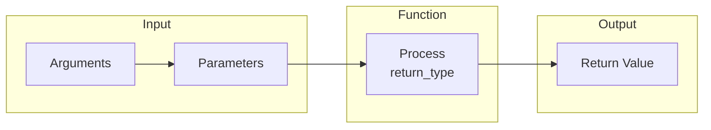

# Functions in C++

## Navigation

- Previous: [Arrays](04-arrays.md)
- Next: —
- Task: [Task 5 - Functions](../tasks/task5-functions.md)

---

##  What is a Function?

A function is a block of code used to perform a specific task.  
It helps in organizing code and avoiding repetition.

---

##  Why use functions?

- Reuse code
- Make code cleaner
- Divide problem into smaller parts

---

##  Syntax

```cpp
return_type function_name(parameters){
    // code
    return value;
}
```

## Visualization



---

##  Example

```cpp
int sum(int a, int b){
    return a + b;
}
```

---

##  Calling a Function

```cpp
cout << sum(3, 4);
```

---

##  Function Types

### 1. Function with return value

```cpp
int square(int x){
    return x * x;
}
```

---

### 2. Void function (no return)

```cpp
void printHello(){
    cout << "Hello";
}
```

---

##  Parameters vs Arguments

- Parameters → variables in function definition
- Arguments → values passed when calling

```cpp
int sum(int a, int b){ // parameters
    return a + b;
}

sum(3, 4); // arguments
```

---

##  Common Mistakes

- Forgetting `return`
- Wrong return type
- Calling function before declaring it

---

##  Tips

- Keep functions small and simple
- Use meaningful names
- Avoid long functions

---

##  Example: Max Function

```cpp
int max(int a, int b){
    if(a > b){
        return a;
    }
    return b;
}
```

---

## Full Example

```cpp
#include <iostream>
using namespace std;

int sum(int a, int b){
    return a + b;
}

int main() {
    int x, y;
    cout << "Enter two numbers: ";
    cin >> x >> y;

    cout << "Sum = " << sum(x, y);

    return 0;
}
```

---

## Practice

###  Easy

- Create function to print numbers

###  Medium

- Create function to find max

###  Challenge

- Build calculator using functions

---

## Summary

- Functions reduce repetition
- Can return value or not
- Improve code structure

---

##  Next Step

Now you should:

1. Go to → [Tasks](../tasks/) and solve all tasks
2. Build projects in → [Projects](../projects/)
3. Solve problems in → [Problems](../problems/)
4. Take the exam → [Exam](../exam.md)

After finishing all of these, move to → OOP Level 
