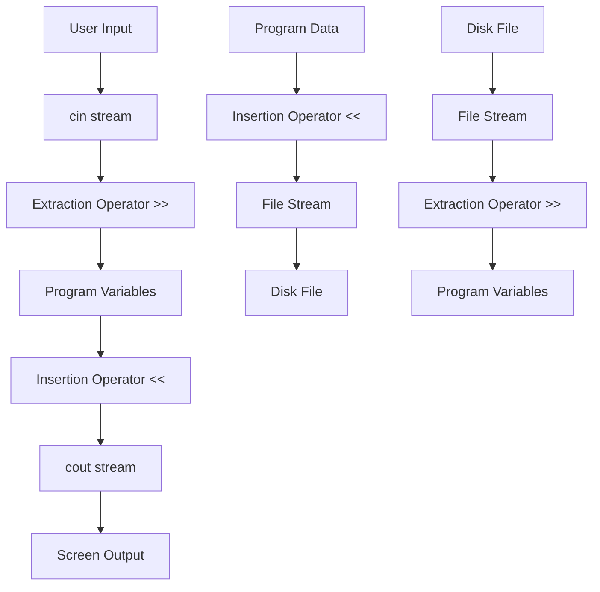

# Input and Output

## Navigation

- Previous: [05 - Functions](05-functions.md)
- Next: [07 - Strings](07-strings.md)

---

## Overview

Input and output (I/O) operations are fundamental to any program. C++ provides multiple ways to handle I/O, including the standard iostream library for console I/O and file stream classes for file I/O.

---

## Explanation

### Standard Input/Output Streams

C++ uses stream classes to handle input and output. The main stream objects are:

- `cin` - standard input (keyboard)
- `cout` - standard output (screen)
- `cerr` - standard error (screen)
- `clog` - standard error with buffering

### Output with cout

The `cout` object is used for output. Use the insertion operator `<<` to send data to the output stream.

```cpp
#include <iostream>
using namespace std;

int main() {
    int age = 25;
    string name = "John";

    cout << "Name: " << name << endl;
    cout << "Age: " << age << endl;

    return 0;
}
```

### Input with cin

The `cin` object is used for input. Use the extraction operator `>>` to read data from the input stream.

```cpp
#include <iostream>
using namespace std;

int main() {
    int number;
    cout << "Enter a number: ";
    cin >> number;
    cout << "You entered: " << number << endl;

    return 0;
}
```

### Multiple Inputs

You can chain multiple inputs or outputs:

```cpp
#include <iostream>
using namespace std;

int main() {
    int a, b, c;
    cin >> a >> b >> c;  // Read three numbers
    cout << a << " " << b << " " << c << endl;

    return 0;
}
```

### Formatted Output

Control the output format using manipulators:

```cpp
#include <iostream>
#include <iomanip>
using namespace std;

int main() {
    double pi = 3.14159265;

    cout << fixed << setprecision(2) << pi << endl;  // 3.14
    cout << setw(10) << right << 42 << endl;        //        42
    cout << hex << 255 << endl;                     // ff
    cout << oct << 64 << endl;                      // 100

    return 0;
}
```

### File Input/Output

Use fstream classes for file operations:

```cpp
#include <fstream>
#include <iostream>
using namespace std;

int main() {
    // Writing to a file
    ofstream outFile("data.txt");
    outFile << "Hello, World!" << endl;
    outFile.close();

    // Reading from a file
    ifstream inFile("data.txt");
    string line;
    while (getline(inFile, line)) {
        cout << line << endl;
    }
    inFile.close();

    return 0;
}
```

### String Streams

Use stringstream for string manipulation:

```cpp
#include <sstream>
#include <iostream>
using namespace std;

int main() {
    stringstream ss;
    ss << "Age: " << 25 << " | Year: " << 2024;

    string result = ss.str();
    cout << result << endl;

    // Parse from stringstream
    int age;
    string temp;
    ss >> temp >> age;  // Extracts "Age:" then 25

    return 0;
}
```

---

## Visualization



---

## Advantages

| Advantage       | Description                                            |
| --------------- | ------------------------------------------------------ |
| Type safety     | C++ streams are type-safe compared to C's printf/scanf |
| Extensibility   | Can overload << and >> for custom types                |
| Object-oriented | Uses classes and objects for I/O operations            |
| Formatted I/O   | Built-in manipulators for formatting                   |
| Buffering       | Efficient I/O through buffering                        |

---

## Disadvantages

| Disadvantage   | Description                             |
| -------------- | --------------------------------------- |
| Performance    | Slightly slower than C's printf/scanf   |
| Complexity     | More verbose for simple operations      |
| Learning curve | Manipulators and flags can be confusing |

---

## Common Mistakes

1. **Forgetting to include `<iostream>`** - Compilation error
2. **Using `>>` with string containing spaces** - Use `getline()` instead
3. **Not checking stream state** - Input can fail silently
4. **Mixing C and C++ I/O** - Can cause buffering issues
5. **Not closing file streams** - Resource leak

---

## Thinking Questions

1. What is the difference between `cout` and `cerr`?
2. How would you read an entire line including spaces?
3. Why is `endl` different from using `\n`?
4. How do file streams handle errors?
5. What is the purpose of string streams?

---

## Practice Problems

1. Write a program that takes a name and age from user and displays them.
2. Create a program that writes your personal info to a file and reads it back.
3. Write a program that formats a number as currency (2 decimal places).
4. Create a program that counts words in a sentence using stringstream.
