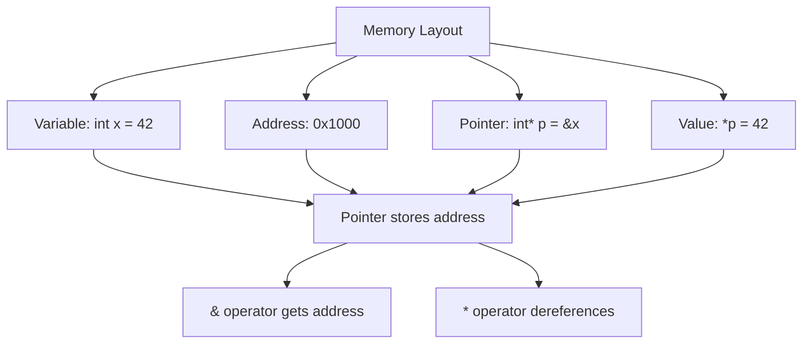

# Pointers

## Navigation

- Previous: [07 - Strings](07-strings.md)
- Next: [09 - References](09-references.md)

---

## Overview

Pointers are variables that store memory addresses of other variables. They are one of the most powerful features in C++, enabling dynamic memory allocation, efficient array handling, and direct memory manipulation.

---

## Explanation

### What is a Pointer?

A pointer is a variable that holds a memory address. The address can be of another variable, an array element, or any valid memory location.

```cpp
#include <iostream>
using namespace std;

int main() {
    int var = 42;
    int* ptr;  // Declaration: pointer to int

    ptr = &var;  // & is address-of operator

    cout << "Value of var: " << var << endl;
    cout << "Address of var: " << &var << endl;
    cout << "Value of ptr: " << ptr << endl;
    cout << "Value pointed to: " << *ptr << endl;

    return 0;
}
```

### Pointer Declaration and Initialization

```cpp
#include <iostream>
using namespace std;

int main() {
    int x = 10;
    int* p1 = &x;      // Initialize with address
    int* p2 = nullptr; // Null pointer (C++11)
    int* p3;           // Uninitialized (dangerous!)

    // Always initialize pointers
    double y = 3.14;
    double* pd = &y;

    char c = 'A';
    char* pc = &c;

    cout << "int pointer: " << *p1 << endl;
    cout << "double pointer: " << *pd << endl;
    cout << "char pointer: " << *pc << endl;

    return 0;
}
```

### Pointer Arithmetic

```cpp
#include <iostream>
using namespace std;

int main() {
    int arr[] = {10, 20, 30, 40, 50};
    int* p = arr;  // Points to first element

    cout << *p << endl;      // 10 (arr[0])
    p++;
    cout << *p << endl;      // 20 (arr[1])
    p += 2;
    cout << *p << endl;     // 40 (arr[3])
    p--;
    cout << *p << endl;      // 30 (arr[2])

    // Difference between pointers
    int* p1 = &arr[0];
    int* p2 = &arr[4];
    cout << "Difference: " << p2 - p1 << endl;  // 4

    return 0;
}
```

### Pointers and Arrays

```cpp
#include <iostream>
using namespace std;

int main() {
    int arr[] = {1, 2, 3, 4, 5};
    int* p = arr;

    // Array name is pointer to first element
    cout << "arr: " << arr << endl;
    cout << "&arr[0]: " << &arr[0] << endl;
    cout << "p: " << p << endl;

    // Accessing array elements through pointer
    for (int i = 0; i < 5; i++) {
        cout << *(p + i) << " ";  // p[i] also works
    }
    cout << endl;

    // Using pointer with loop
    for (int* q = p; q < p + 5; q++) {
        cout << *q << " ";
    }
    cout << endl;

    return 0;
}
```

### Dynamic Memory Allocation

```cpp
#include <iostream>
using namespace std;

int main() {
    // Single variable
    int* ptr1 = new int;
    *ptr1 = 100;
    cout << *ptr1 << endl;
    delete ptr1;  // Free memory

    // Array
    int n = 5;
    int* arr = new int[n];
    for (int i = 0; i < n; i++) {
        arr[i] = (i + 1) * 10;
    }
    for (int i = 0; i < n; i++) {
        cout << arr[i] << " ";
    }
    delete[] arr;  // Free array memory

    return 0;
}
```

### Pointer to Constant and Constant Pointer

```cpp
#include <iostream>
using namespace std;

int main() {
    int a = 10, b = 20;

    // Pointer to constant
    const int* p1 = &a;
    // *p1 = 30;  // Error: cannot modify through const pointer
    p1 = &b;     // OK: can change what pointer points to

    // Constant pointer
    int* const p2 = &a;
    *p2 = 30;    // OK: can modify value
    // p2 = &b;   // Error: cannot change pointer

    // Constant pointer to constant
    const int* const p3 = &a;
    // Both *p3 and p3 cannot be changed

    return 0;
}
```

### Void Pointer

```cpp
#include <iostream>
using namespace std;

int main() {
    int a = 10;
    double b = 3.14;
    char c = 'X';

    void* ptr;

    ptr = &a;
    cout << "int: " << *(static_cast<int*>(ptr)) << endl;

    ptr = &b;
    cout << "double: " << *(static_cast<double*>(ptr)) << endl;

    ptr = &c;
    cout << "char: " << *(static_cast<char*>(ptr)) << endl;

    return 0;
}
```

---

## Visualization



---

## Advantages

| Advantage                | Description                             |
| ------------------------ | --------------------------------------- |
| Dynamic memory           | Allocate memory at runtime              |
| Efficient array handling | Pass arrays without copying             |
| Function modifiers       | Modify variables outside function scope |
| Data structures          | Build linked lists, trees, graphs       |

---

## Disadvantages

| Disadvantage        | Description                    |
| ------------------- | ------------------------------ |
| Complexity          | Hard to understand and debug   |
| Dangling pointers   | Pointers to freed memory       |
| Memory leaks        | Forgotten delete statements    |
| Null pointer errors | Accessing null pointer crashes |

---

## Common Mistakes

1. **Using uninitialized pointers** - Contains garbage address
2. **Forgetting to delete dynamically allocated memory** - Memory leak
3. **Deleting already deleted memory** - Undefined behavior
4. **Pointer arithmetic on non-array** - Undefined behavior
5. **Confusing `*` in declaration vs. dereference** - Different meanings

---

## Thinking Questions

1. What is the difference between `int* p` and `int *p`?
2. Why should you initialize pointers to `nullptr`?
3. What happens when you dereference a null pointer?
4. How does pointer arithmetic differ for different types?
5. What is the relationship between arrays and pointers?

---

## Practice Problems

1. Write a program to swap two numbers using pointers.
2. Create a function that finds the maximum element in an array using pointers.
3. Write a program to dynamically allocate and deallocate a 2D array.
4. Create a program that demonstrates pointer arithmetic.
5. Write a program to implement a simple dynamic list using pointers.
