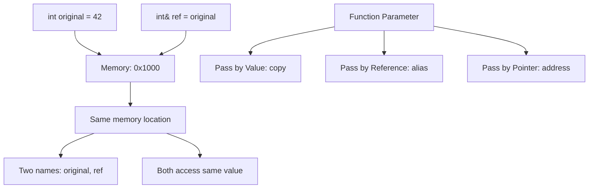

# References

## Navigation

- Previous: [08 - Pointers](08-pointers.md)
- Next: [10 - Type Casting](10-type-casting.md)

---

## Overview

References are aliases (alternative names) for existing variables. They provide a way to access a variable by another name without the complexity of pointers. References are widely used in function parameters, return types, and for creating aliases.

---

## Explanation

### What is a Reference?

A reference is an alias (alternative name) for an existing variable. Once initialized, a reference cannot be changed to refer to a different variable.

```cpp
#include <iostream>
using namespace std;

int main() {
    int original = 42;
    int& ref = original;  // ref is an alias for original

    cout << "Original: " << original << endl;
    cout << "Reference: " << ref << endl;

    ref = 100;  // Modifies original

    cout << "After modifying ref:" << endl;
    cout << "Original: " << original << endl;
    cout << "Reference: " << ref << endl;

    return 0;
}
```

### Reference vs Pointer

```cpp
#include <iostream>
using namespace std;

void withPointer(int* p) {
    *p = 100;  // Must dereference
}

void withReference(int& r) {
    r = 100;  // Direct access
}

int main() {
    int value = 50;

    withPointer(&value);  // Need address-of operator
    cout << "After pointer: " << value << endl;

    value = 50;  // Reset
    withReference(value);  // No need for & or *
    cout << "After reference: " << value << endl;

    return 0;
}
```

### References in Function Parameters

```cpp
#include <iostream>
using namespace std;

// Pass by value - copies the argument
void swapByValue(int a, int b) {
    int temp = a;
    a = b;
    b = temp;
}

// Pass by reference - no copying
void swapByReference(int& a, int& b) {
    int temp = a;
    a = b;
    b = temp;
}

// Pass by pointer - explicit address
void swapByPointer(int* a, int* b) {
    int temp = *a;
    *a = *b;
    *b = temp;
}

int main() {
    int x = 5, y = 10;

    swapByValue(x, y);
    cout << "After pass by value: " << x << ", " << y << endl;

    x = 5; y = 10;
    swapByReference(x, y);
    cout << "After pass by reference: " << x << ", " << y << endl;

    x = 5; y = 10;
    swapByPointer(&x, &y);
    cout << "After pass by pointer: " << x << ", " << y << endl;

    return 0;
}
```

### Const References

```cpp
#include <iostream>
using namespace std;

void printValue(const int& ref) {
    // ref = 100;  // Error: cannot modify
    cout << "Value: " << ref << endl;
}

int main() {
    int x = 42;
    const int& ref = x;  // Cannot modify through ref

    // ref = 100;  // Error
    cout << "Value: " << ref << endl;

    printValue(x);
    printValue(50);  // Can bind to temporary

    return 0;
}
```

### Returning References

```cpp
#include <iostream>
using namespace std;

int arr[] = {10, 20, 30, 40, 50};

int& getElement(int index) {
    return arr[index];  // Returns reference to element
}

int main() {
    cout << "Original: " << arr[2] << endl;

    getElement(2) = 300;  // Modify through reference

    cout << "Modified: " << arr[2] << endl;

    return 0;
}
```

### References as Aliases

```cpp
#include <iostream>
using namespace std;

int main() {
    int number = 42;
    int& ref = number;

    // Both refer to the same memory location
    cout << "number: " << number << endl;
    cout << "ref: " << ref << endl;
    cout << "&number: " << &number << endl;
    cout << "&ref: " << &ref << endl;

    // Reference cannot be reseated
    int number2 = 100;
    // ref = number2;  // This assigns value, not rebinding

    cout << "After ref = number2: " << number << endl;

    return 0;
}
```

### Reference to Pointer

```cpp
#include <iostream>
using namespace std;

int main() {
    int x = 10;
    int* ptr = &x;

    int*& refPtr = ptr;  // Reference to pointer

    cout << "Before: " << *ptr << endl;
    *refPtr = 20;
    cout << "After: " << *ptr << endl;

    int y = 30;
    refPtr = &y;
    cout << "After rebinding ptr: " << *ptr << endl;

    return 0;
}
```

---

## Visualization



---

## Advantages

| Advantage      | Description                            |
| -------------- | -------------------------------------- |
| Cleaner syntax | No dereferencing needed                |
| Safety         | Cannot be null (must be initialized)   |
| No copying     | Efficient for large objects            |
| Natural syntax | Looks like passing the variable itself |

---

## Disadvantages

| Disadvantage       | Description                        |
| ------------------ | ---------------------------------- |
| Cannot be null     | Always bound to an object          |
| Cannot be reseated | Cannot change what it refers to    |
| Less flexible      | Cannot do pointer arithmetic       |
| Learning curve     | Can be confused with pass-by-value |

---

## Common Mistakes

1. **Not initializing references** - Must be initialized when declared
2. **Returning reference to local variable** - Dangling reference
3. **Confusing & in declaration vs. address-of operator** - Different meanings
4. **Thinking reference is a copy** - It's an alias
5. **Trying to create arrays of references** - Not allowed in C++

---

## Thinking Questions

1. What is the main difference between pointers and references?
2. Why must references be initialized?
3. Can a reference be null? Why or why not?
4. What is the purpose of const references?
5. When should you use references over pointers?

---

## Practice Problems

1. Write a function that uses a reference to find the maximum of three numbers.
2. Create a function that modifies a string using a reference.
3. Write a program to demonstrate that reference and original share the same address.
4. Create a function that returns a reference to the largest element in an array.
5. Write a program to swap two strings using references.
