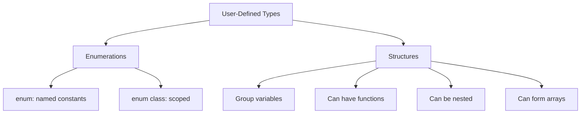

# Enumerations and Structures

## Navigation

- Previous: [10 - Type Casting](10-type-casting.md)
- Next: —

---

## Overview

Enumerations (enums) and structures (structs) are user-defined data types that help organize related data. Enums create named constant values, while structures group different data types together.

---

## Explanation

### Enumerations (enum)

An enumeration is a set of named integer constants:

```cpp
#include <iostream>
using namespace std;

// Traditional enum
enum Color {
    RED = 1,
    GREEN = 2,
    BLUE = 3
};

int main() {
    Color c = RED;

    cout << "Color value: " << c << endl;

    if (c == RED) {
        cout << "Selected color is RED" << endl;
    }

    // Switch with enum
    switch (c) {
        case RED:   cout << "Red" << endl; break;
        case GREEN: cout << "Green" << endl; break;
        case BLUE:  cout << "Blue" << endl; break;
    }

    return 0;
}
```

### Enum Class (Scoped Enumeration)

```cpp
#include <iostream>
using namespace std;

// Enum class - scoped and stronger type safety
enum class Day {
    MONDAY = 1,
    TUESDAY = 2,
    WEDNESDAY = 3,
    THURSDAY = 4,
    FRIDAY = 5,
    SATURDAY = 6,
    SUNDAY = 7
};

int main() {
    Day today = Day::MONDAY;

    // Must use scope resolution
    cout << "Day value: " << static_cast<int>(today) << endl;

    // No implicit conversion to int
    // int d = today;  // Error
    int d = static_cast<int>(today);  // OK

    return 0;
}
```

### Enum with Underlying Type

```cpp
#include <iostream>
using namespace std;

// Specify underlying type
enum class Status : unsigned char {
    PENDING = 0,
    SUCCESS = 1,
    FAILED = 2
};

int main() {
    Status s = Status::SUCCESS;

    cout << "Status size: " << sizeof(s) << endl;
    cout << "Status value: " << static_cast<int>(s) << endl;

    return 0;
}
```

### Structures (struct)

A structure is a composite data type that groups different variables:

```cpp
#include <iostream>
#include <string>
using namespace std;

struct Person {
    string name;
    int age;
    double height;
};

int main() {
    Person p1;
    p1.name = "John";
    p1.age = 25;
    p1.height = 5.9;

    cout << "Name: " << p1.name << endl;
    cout << "Age: " << p1.age << endl;
    cout << "Height: " << p1.height << endl;

    return 0;
}
```

### Structure Initialization

```cpp
#include <iostream>
using namespace std;

struct Point {
    int x;
    int y;
};

int main() {
    // Different initialization methods
    Point p1 = {10, 20};           // Brace initialization
    Point p2 = {.x = 30, .y = 40}; // Designated initializer
    Point p3{50, 60};              // Uniform initialization

    cout << "p1: " << p1.x << ", " << p1.y << endl;
    cout << "p2: " << p2.x << ", " << p2.y << endl;
    cout << "p3: " << p3.x << ", " << p3.y << endl;

    return 0;
}
```

### Structure with Functions

```cpp
#include <iostream>
using namespace std;

struct Rectangle {
    double width;
    double height;

    // Member function
    double area() {
        return width * height;
    }

    // Member function
    double perimeter() {
        return 2 * (width + height);
    }
};

int main() {
    Rectangle r{5.0, 3.0};

    cout << "Area: " << r.area() << endl;
    cout << "Perimeter: " << r.perimeter() << endl;

    return 0;
}
```

### Nested Structures

```cpp
#include <iostream>
using namespace std;

struct Date {
    int day;
    int month;
    int year;
};

struct Employee {
    string name;
    int id;
    Date hireDate;
};

int main() {
    Employee emp;
    emp.name = "Alice";
    emp.id = 1001;
    emp.hireDate = {15, 3, 2022};

    cout << "Name: " << emp.name << endl;
    cout << "Hire Date: " << emp.hireDate.day << "/"
         << emp.hireDate.month << "/"
         << emp.hireDate.year << endl;

    return 0;
}
```

### Array of Structures

```cpp
#include <iostream>
using namespace std;

struct Student {
    string name;
    int grade;
};

int main() {
    Student students[3] = {
        {"Alice", 95},
        {"Bob", 87},
        {"Charlie", 92}
    };

    for (int i = 0; i < 3; i++) {
        cout << students[i].name << ": "
             << students[i].grade << endl;
    }

    return 0;
}
```

### Passing Structures to Functions

```cpp
#include <iostream>
using namespace std;

struct Point {
    int x;
    int y;
};

// Pass by value
void printPointByValue(Point p) {
    cout << "(" << p.x << ", " << p.y << ")" << endl;
}

// Pass by reference
void printPointByRef(Point& p) {
    cout << "(" << p.x << ", " << p.y << ")" << endl;
}

// Pass by const reference
void printPointByConstRef(const Point& p) {
    cout << "(" << p.x << ", " << p.y << ")" << endl;
}

int main() {
    Point p{10, 20};

    printPointByValue(p);
    printPointByRef(p);
    printPointByConstRef(p);

    return 0;
}
```

---

## Visualization



---

## Advantages

| Advantage    | Description                               |
| ------------ | ----------------------------------------- |
| Readability  | Meaningful names instead of magic numbers |
| Type safety  | enum class prevents implicit conversions  |
| Organization | Group related data together               |
| Reusability  | Create custom types for problem domain    |

---

## Disadvantages

| Disadvantage     | Description                                    |
| ---------------- | ---------------------------------------------- |
| Limited methods  | Structs cannot have private members by default |
| Enum limitations | Traditional enum has implicit conversion       |
| Verbosity        | More code than simple variables                |

---

## Common Mistakes

1. **Using magic numbers instead of enums** - Reduces readability
2. **Forgetting scope resolution with enum class** - Compilation error
3. **Not specifying underlying type for enum** - Platform-dependent size
4. **Confusing struct with class** - Default access specifier difference
5. **Not initializing structure members** - Undefined values

---

## Thinking Questions

1. What is the difference between enum and enum class?
2. Why should you prefer enum class over traditional enum?
3. What is the default access specifier in a struct?
4. How do you pass a structure to a function efficiently?
5. Can a structure contain member functions?

---

## Practice Problems

1. Write a program to create an enum for days of the week.
2. Create a program to store and display student information using struct.
3. Write a program to calculate area and perimeter using struct with functions.
4. Create a program to manage an array of points.
5. Write a program to demonstrate nested structures (Date inside Employee).
