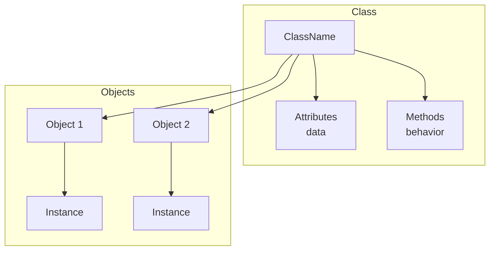

# Classes in C++

## Navigation

- Previous: —
- Next: [Encapsulation](02-encapsulation.md)
- Task: [Task 1 - Classes](../tasks/task1-classes.md)

---

##  What is a Class?

A class is a blueprint used to create objects.

It allows you to group:

- data (variables)
- behavior (functions)

---

## Why Use Classes?

- Organize code
- Represent real-world objects
- Reuse logic
- Improve readability

---

##  Basic Structure

```cpp
class ClassName {
public:
    // variables
    // functions
};
```

## Visualization



---

##  Example

```cpp
#include <iostream>
using namespace std;

class Person {
public:
    string name;
    int age;

    void sayHello() {
        cout << "Hello " << name << endl;
    }
};
```

---

##  Creating Object

```cpp
Person p1;

p1.name = "Mohamed";
p1.age = 20;

p1.sayHello();
```

---

##  Key Concepts

- Class → blueprint
- Object → instance
- Members → variables + functions

---

## Common Mistakes

- Forgetting `;` after class ❌
- Not using access specifier (`public`) ❌
- Confusing class and object ❌

---

##  Tips

- Keep classes simple
- Use meaningful names
- One class = one responsibility

---

## Full Example

```cpp
#include <iostream>
using namespace std;

class Car {
public:
    string brand;
    int speed;

    void display() {
        cout << "Brand: " << brand << endl;
        cout << "Speed: " << speed << endl;
    }
};

int main() {
    Car c;

    c.brand = "BMW";
    c.speed = 200;

    c.display();

    return 0;
}
```

---

## Practice

###  Easy

- Create class `Student`
- Add name and age

###  Medium

- Add function to print data

###  Challenge

- Create 2 objects and print both

---

##  Apply What You Learned

Go to → [Task 1: Classes](../tasks/task1-classes.md)

> Do not move forward before solving the task.

---

## Next Lesson

Go to → [02-encapsulation](../notes/02-encapsulation.md)