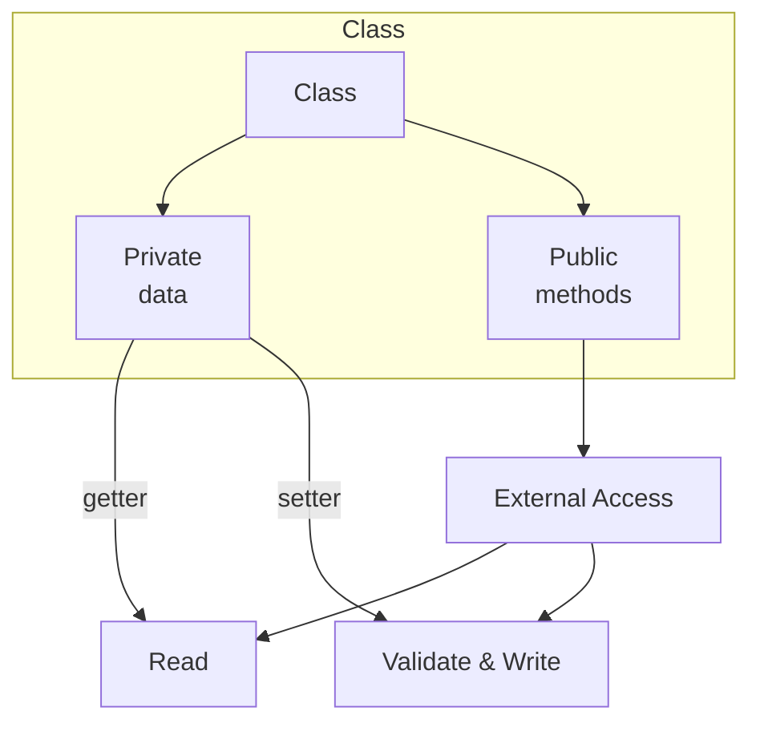

# Encapsulation in C++

## Navigation

- Previous: [Classes](01-classes.md)
- Next: [Inheritance](03-inheritance.md)
- Task: [Task 2 - Encapsulation](../tasks/task2-encapsulation.md)

---

##  What is Encapsulation?

Encapsulation means hiding data and controlling access to it.

Instead of accessing variables directly, we use:

- getters (to read data)
- setters (to modify data)

---

##  Why Encapsulation?

- Protect data
- Prevent wrong usage
- Control how data is changed

---

##  Example (Without Encapsulation ❌)

```cpp
class Person {
public:
    int age;
};
```

Here, anyone can set `age` to any value, even if it's incorrect.

---

##  Example (With Encapsulation ✅)

```cpp
class Person {
private:
    int age;

public:
    void setAge(int a) {
        if(a > 0){
            age = a;
        }
    }

    int getAge() {
        return age;
    }
};
```

---

##  Using the Class

```cpp
Person p;

p.setAge(20);
cout << p.getAge();
```

---

##  Access Specifiers

| Type      | Description             |
| --------- | ----------------------- |
| public    | accessible everywhere   |
| private   | accessible inside class |
| protected | for inheritance         |

## Visualization



---

## Common Mistakes

- Making everything public ❌
- No validation in setter ❌
- Forgetting getter ❌

---

##  Tips

- Always keep data private
- Use setters to validate input
- Keep getters simple

---

## Full Example

```cpp
#include <iostream>
using namespace std;

class Student {
private:
    int grade;

public:
    void setGrade(int g){
        if(g >= 0 && g <= 100){
            grade = g;
        }
    }

    int getGrade(){
        return grade;
    }
};

int main() {
    Student s;

    s.setGrade(90);
    cout << "Grade: " << s.getGrade();

    return 0;
}
```

---

## Practice

###  Easy

- Create class with private variable

###  Medium

- Add getter and setter

###  Challenge

- Add validation in setter

---

##  Apply What You Learned

Go to → [Task 2: Encapsulation](../tasks/task2-encapsulation.md)

> Do not move forward before solving the task.

---

## Next Lesson

Go to → [03-inheritance](../notes/03-inheritance.md)
