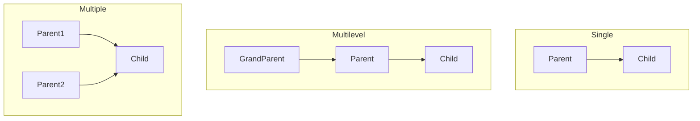

# Inheritance in C++

## Navigation

- Previous: [Encapsulation](02-encapsulation.md)
- Next: [Polymorphism](04-polymorphism.md)
- Task: [Task 3 - Inheritance](../tasks/task3-inheritance.md)

---

##  What is Inheritance?

Inheritance allows one class to use properties and functions of another class.

It helps in:

- code reuse
- reducing duplication
- building relationships between classes

---

## Real-life Example

A `Dog` is an `Animal`.

So instead of rewriting code, we inherit from the base class.

---

##  Syntax

```cpp
class Child : public Parent {
};
```

---

##  Example

```cpp
#include <iostream>
using namespace std;

class Animal {
public:
    void speak() {
        cout << "Animal makes sound" << endl;
    }
};

class Dog : public Animal {
public:
    void bark() {
        cout << "Dog barks" << endl;
    }
};
```

---

##  Using Inheritance

```cpp
Dog d;

d.speak(); // from Animal
d.bark();  // from Dog
```

---

##  Types of Inheritance

| Type       | Description            |
| ---------- | ---------------------- |
| Single     | One parent → one child |
| Multilevel | Chain inheritance      |
| Multiple   | Multiple parents       |

## Visualization



---

## Common Mistakes

- Forgetting access specifier (`public`) ❌
- Redefining instead of reusing ❌
- Wrong class relationships ❌

---

##  Tips

- Use inheritance only when there is a real relationship
- Avoid unnecessary inheritance
- Keep hierarchy simple

---

## Full Example

```cpp
#include <iostream>
using namespace std;

class Vehicle {
public:
    int speed;

    void move() {
        cout << "Vehicle is moving" << endl;
    }
};

class Car : public Vehicle {
public:
    void display() {
        cout << "Speed: " << speed << endl;
    }
};

int main() {
    Car c;

    c.speed = 120;
    c.move();
    c.display();

    return 0;
}
```

---

##  Practice

###  Easy

- Create base class `Animal`

###  Medium

- Create child class `Dog`

###  Challenge

- Add another child class `Cat`

---

##  Apply What You Learned

Go to → [Task 3: Inheritance](../tasks/task3-inheritance.md)

> Do not move forward before solving the task.

---

## Next Lesson

Go to → [polymorphism.md](../notes/04-polymorphism.md)
