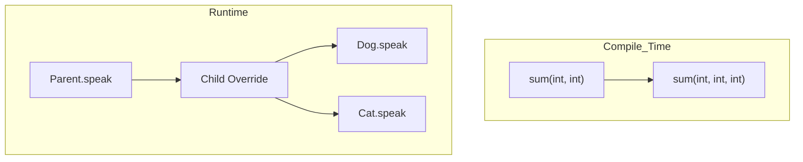

# Polymorphism in C++

## Navigation

- Previous: [Inheritance](03-inheritance.md)
- Next: [Abstraction](05-abstraction.md)
- Task: [Task 4 - Polymorphism](../tasks/task4-polymorphism.md)

---

## 📌 What is Polymorphism?

Polymorphism means "many forms".

It allows the same function name to behave differently depending on the object.

---

## Why Polymorphism?

- Makes code flexible
- Improves reusability
- Allows different behaviors using same interface

---

##  Types of Polymorphism

| Type         | Description          |
| ------------ | -------------------- |
| Compile-time | Function Overloading |
| Runtime      | Function Overriding  |

## Visualization



---

##  Function Overloading (Compile-time)

Same function name, different parameters.

```cpp
int sum(int a, int b){
    return a + b;
}

int sum(int a, int b, int c){
    return a + b + c;
}
```

---

##  Function Overriding (Runtime)

Child class redefines function of parent class.

```cpp
class Animal {
public:
    void speak(){
        cout << "Animal sound" << endl;
    }
};

class Dog : public Animal {
public:
    void speak(){
        cout << "Dog barks" << endl;
    }
};
```

---

##  Using Overriding

```cpp
Dog d;
d.speak(); // Dog version
```

---

## Important Note

To achieve real runtime polymorphism, we use:

- `virtual` keyword
- pointers (advanced topic)

---

## Common Mistakes

- Wrong function signature ❌
- Forgetting override ❌
- Confusing overloading with overriding ❌

---

##  Tips

- Use overloading for simple cases
- Use overriding for inheritance-based behavior
- Keep function names meaningful

---

## Full Example

```cpp
#include <iostream>
using namespace std;

class Shape {
public:
    void draw(){
        cout << "Drawing shape" << endl;
    }
};

class Circle : public Shape {
public:
    void draw(){
        cout << "Drawing circle" << endl;
    }
};

int main() {
    Circle c;
    c.draw();

    return 0;
}
```

---

## Practice

###  Easy

- Create two functions with same name

###  Medium

- Override function in child class

###  Challenge

- Create 2 child classes with different behavior

---

##  Apply What You Learned

Go to → [Task 4: Polymorphism](../tasks/task4-polymorphism.md)

> Do not move forward before solving the task.

---

## Next Lesson

Go to → [05-abstraction](../notes/05-abstraction.md)
