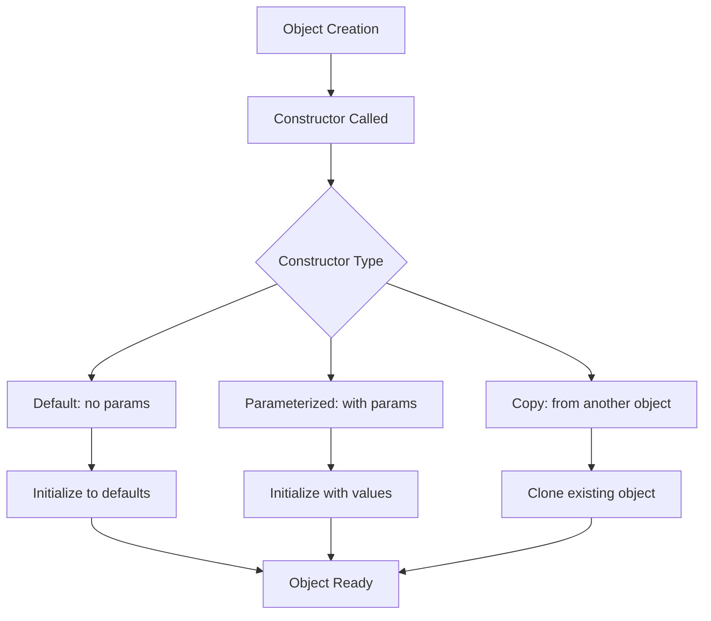

# Constructors

## Navigation

- Previous: [05 - Abstraction](05-abstraction.md)
- Next: [07 - Destructors](07-destructors.md)

---

## Overview

Constructors are special member functions that are automatically called when an object is created. They are used to initialize objects, allocate resources, and set up the initial state of a class. Constructors have the same name as the class and do not have a return type.

---

## Explanation

### Default Constructor

A constructor that takes no parameters is called a default constructor. If no constructor is defined, C++ provides an implicit default constructor.

```cpp
#include <iostream>
using namespace std;

class Player {
private:
    string name;
    int score;

public:
    // Default constructor
    Player() {
        name = "Unknown";
        score = 0;
        cout << "Player created: " << name << endl;
    }

    void display() {
        cout << "Name: " << name << ", Score: " << score << endl;
    }
};

int main() {
    Player p1;      // Calls default constructor
    p1.display();

    return 0;
}
```

### Parameterized Constructor

Constructors that accept parameters are used to initialize objects with specific values.

```cpp
#include <iostream>
using namespace std;

class BankAccount {
private:
    string accountNumber;
    double balance;

public:
    // Parameterized constructor
    BankAccount(string accNum, double initialBalance) {
        accountNumber = accNum;
        balance = initialBalance;
    }

    void display() {
        cout << "Account: " << accountNumber
             << ", Balance: $" << balance << endl;
    }
};

int main() {
    BankAccount acc1("ACC001", 1000.0);
    BankAccount acc2("ACC002", 2500.0);

    acc1.display();
    acc2.display();

    return 0;
}
```

### Constructor Overloading

A class can have multiple constructors with different parameter lists.

```cpp
#include <iostream>
using namespace std;

class Rectangle {
private:
    double width;
    double height;

public:
    // Default constructor
    Rectangle() {
        width = 1.0;
        height = 1.0;
    }

    // Parameterized constructor (one parameter)
    Rectangle(double side) {
        width = side;
        height = side;
    }

    // Parameterized constructor (two parameters)
    Rectangle(double w, double h) {
        width = w;
        height = h;
    }

    double area() {
        return width * height;
    }

    void display() {
        cout << "Width: " << width << ", Height: " << height
             << ", Area: " << area() << endl;
    }
};

int main() {
    Rectangle r1;           // Default
    Rectangle r2(5.0);     // Square
    Rectangle r3(3.0, 4.0); // Rectangle

    r1.display();
    r2.display();
    r3.display();

    return 0;
}
```

### Initializer List

Constructor initializer lists provide a more efficient way to initialize member variables.

```cpp
#include <iostream>
using namespace std;

class Student {
private:
    string name;
    int id;
    double gpa;

public:
    // Using initializer list
    Student(string n, int i, double g) : name(n), id(i), gpa(g) {
        cout << "Student initialized: " << name << endl;
    }

    void display() {
        cout << "Name: " << name << ", ID: " << id
             << ", GPA: " << gpa << endl;
    }
};

int main() {
    Student s1("Alice", 101, 3.8);
    Student s2("Bob", 102, 3.5);

    s1.display();
    s2.display();

    return 0;
}
```

### Copy Constructor

A copy constructor creates a new object as a copy of an existing object.

```cpp
#include <iostream>
using namespace std;

class Box {
private:
    double length;
    double breadth;
    double height;

public:
    // Parameterized constructor
    Box(double l, double b, double h) {
        length = l;
        breadth = b;
        height = h;
    }

    // Copy constructor
    Box(const Box& obj) {
        length = obj.length;
        breadth = obj.breadth;
        height = obj.height;
        cout << "Copy constructor called" << endl;
    }

    double volume() {
        return length * breadth * height;
    }
};

int main() {
    Box b1(10, 5, 3);
    Box b2 = b1;  // Calls copy constructor

    cout << "Volume of b1: " << b1.volume() << endl;
    cout << "Volume of b2: " << b2.volume() << endl;

    return 0;
}
```

### Constructor with Validation

```cpp
#include <iostream>
using namespace std;

class Temperature {
private:
    double celsius;

public:
    // Constructor that accepts Fahrenheit and converts
    Temperature(double fahrenheit) {
        celsius = (fahrenheit - 32) * 5.0 / 9.0;
    }

    double getCelsius() {
        return celsius;
    }

    double getFahrenheit() {
        return celsius * 9.0 / 5.0 + 32;
    }

    void display() {
        cout << "Celsius: " << celsius << endl;
        cout << "Fahrenheit: " << getFahrenheit() << endl;
    }
};

int main() {
    Temperature t1(32);   // Freezing point
    Temperature t2(212);  // Boiling point

    cout << "Freezing point:" << endl;
    t1.display();

    cout << "\nBoiling point:" << endl;
    t2.display();

    return 0;
}
```

---

## Visualization



---

## Advantages

| Advantage                | Description                       |
| ------------------------ | --------------------------------- |
| Automatic initialization | Objects are always in valid state |
| Overloading              | Multiple ways to create objects   |
| Encapsulation            | Hide initialization logic         |
| Type safety              | Compile-time type checking        |

---

## Disadvantages

| Disadvantage | Description                                       |
| ------------ | ------------------------------------------------- |
| Complexity   | Multiple constructors can be confusing            |
| Performance  | Initialization list should be used for efficiency |
| Side effects | Constructors can have unintended effects          |

---

## Common Mistakes

1. **Forgetting to initialize all members** - Leads to garbage values
2. **Confusing constructor with destructor** - Different purposes
3. **Not using initializer list for const members** - Compilation error
4. **Having constructor with same parameters as copy constructor** - Ambiguity
5. **Not providing default constructor when needed** - Compilation error

---

## Thinking Questions

1. What is the difference between default and parameterized constructors?
2. Why should you use initializer lists for member initialization?
3. When is the copy constructor called?
4. Can a constructor return a value? Why or why not?
5. What happens if you don't define any constructor?

---

## Practice Problems

1. Create a class `Circle` with radius and calculate area using constructor.
2. Create a class `Date` with day, month, year and validate the date.
3. Create a class `Complex` with real and imaginary parts and add two complex numbers.
4. Create a class `Person` with name and age, and handle both default and parameterized construction.
5. Create a class `Matrix` (2x2) with constructor that initializes to identity matrix.
