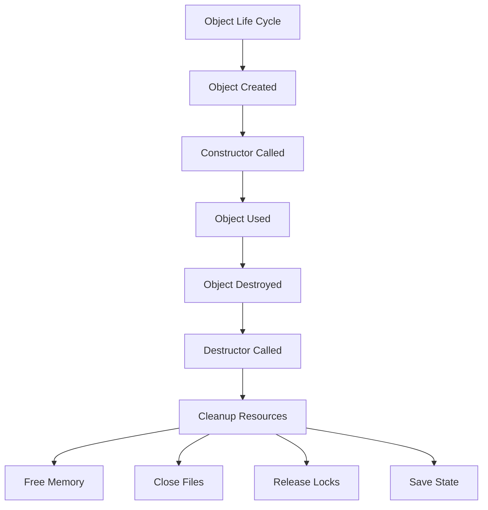

# Destructors

## Navigation

- Previous: [06 - Constructors](06-constructors.md)
- Next: [08 - Static Members](08-static.md)

---

## Overview

Destructors are special member functions that are automatically called when an object is destroyed or goes out of scope. They are used to perform cleanup operations such as releasing resources, closing files, freeing dynamic memory, or saving state.

---

## Explanation

### What is a Destructor?

A destructor has the same name as the class preceded by a tilde (~) and takes no parameters. There can only be one destructor per class.

```cpp
#include <iostream>
using namespace std;

class Logger {
private:
    string message;

public:
    Logger(string msg) : message(msg) {
        cout << "Object created: " << message << endl;
    }

    ~Logger() {
        cout << "Object destroyed: " << message << endl;
    }

    void log() {
        cout << message << endl;
    }
};

int main() {
    Logger l1("First");
    l1.log();
    {
        Logger l2("Second");
        l2.log();
    }  // l2 destroyed here

    cout << "After inner block" << endl;
}  // l1 destroyed here

// Output:
// Object created: First
// First
// Object created: Second
// Second
// Object destroyed: Second
// After inner block
// Object destroyed: First
```

### Destructor for Resource Cleanup

```cpp
#include <iostream>
using namespace std;

class FileHandler {
private:
    string filename;
    bool isOpen;

public:
    FileHandler(string name) : filename(name), isOpen(false) {
        cout << "Opening file: " << filename << endl;
        isOpen = true;
    }

    ~FileHandler() {
        if (isOpen) {
            cout << "Closing file: " << filename << endl;
            isOpen = false;
        }
    }

    void write(string data) {
        cout << "Writing to " << filename << ": " << data << endl;
    }
};

int main() {
    FileHandler file("data.txt");
    file.write("Hello");

    return 0;
}  // Destructor called automatically
```

### Destructor for Dynamic Memory

```cpp
#include <iostream>
using namespace std;

class DynamicArray {
private:
    int* array;
    int size;

public:
    DynamicArray(int s) : size(s) {
        array = new int[size];
        cout << "Memory allocated for " << size << " elements" << endl;
    }

    ~DynamicArray() {
        delete[] array;
        cout << "Memory freed" << endl;
    }

    void set(int index, int value) {
        if (index >= 0 && index < size) {
            array[index] = value;
        }
    }

    int get(int index) {
        if (index >= 0 && index < size) {
            return array[index];
        }
        return 0;
    }
};

int main() {
    DynamicArray arr(5);
    arr.set(0, 10);
    arr.set(1, 20);
    cout << "Element 0: " << arr.get(0) << endl;
    cout << "Element 1: " << arr.get(1) << endl;

    return 0;
}  // Destructor frees the memory
```

### Virtual Destructor

When a base class pointer points to a derived class object, the destructor must be virtual to ensure proper cleanup.

```cpp
#include <iostream>
using namespace std;

class Base {
public:
    Base() {
        cout << "Base constructor" << endl;
    }

    virtual ~Base() {
        cout << "Base destructor" << endl;
    }
};

class Derived : public Base {
public:
    Derived() {
        cout << "Derived constructor" << endl;
    }

    ~Derived() override {
        cout << "Derived destructor" << endl;
    }
};

int main() {
    Base* ptr = new Derived();
    delete ptr;

    return 0;
}

// Output:
// Base constructor
// Derived constructor
// Derived destructor
// Base destructor
```

### Destructor Order

```cpp
#include <iostream>
using namespace std;

class A {
    string name;
public:
    A(string n) : name(n) {
        cout << "Constructor: " << name << endl;
    }

    ~A() {
        cout << "Destructor: " << name << endl;
    }
};

int main() {
    A obj1("First");
    {
        A obj2("Second");
        A obj3("Third");
    }  // Third destroyed, then Second

    cout << "After block" << endl;
}  // First destroyed last

// Output:
// Constructor: First
// Constructor: Second
// Constructor: Third
// Destructor: Third
// Destructor: Second
// After block
// Destructor: First
```

### RAII Pattern (Resource Acquisition Is Initialization)

```cpp
#include <iostream>
using namespace std;

class Mutex {
private:
    bool locked;
public:
    Mutex() : locked(false) {
        cout << "Mutex created" << endl;
    }

    void lock() {
        locked = true;
        cout << "Mutex locked" << endl;
    }

    void unlock() {
        locked = false;
        cout << "Mutex unlocked" << endl;
    }

    ~Mutex() {
        if (locked) {
            cout << "Auto-unlocking mutex" << endl;
            unlocked();
        }
    }
};

void criticalFunction() {
    Mutex m;
    m.lock();
    cout << "Performing critical operation" << endl;
    // Mutex automatically unlocked when m goes out of scope
}

int main() {
    criticalFunction();
    cout << "Function completed" << endl;

    return 0;
}
```

---

## Visualization



---

## Advantages

| Advantage            | Description                              |
| -------------------- | ---------------------------------------- |
| Automatic cleanup    | Resources freed even if exceptions occur |
| Exception safety     | Works with RAII pattern                  |
| Encapsulation        | Cleanup logic hidden from user           |
| Predictable behavior | Called at predictable times              |

---

## Disadvantages

| Disadvantage      | Description                             |
| ----------------- | --------------------------------------- |
| No parameters     | Cannot pass data to destructor          |
| Single destructor | Cannot have multiple destructors        |
| Timing issues     | Called at end of scope, may be too late |

---

## Common Mistakes

1. **Not making base destructor virtual** - Memory leak with polymorphism
2. **Calling delete on null pointer** - Safe but indicates design issue
3. **Doing too much in destructor** - Can cause exceptions during cleanup
4. **Forgetting to delete dynamically allocated memory** - Memory leak
5. **Throwing exceptions in destructor** - Undefined behavior

---

## Thinking Questions

1. Why should destructors not throw exceptions?
2. What is the difference between virtual and non-virtual destructors?
3. When is a destructor called automatically?
4. What is the RAII pattern and why is it important?
5. Can you call a destructor explicitly? When would you?

---

## Practice Problems

1. Create a class that simulates a database connection with proper cleanup.
2. Create a class that manages a dynamic array and properly frees memory.
3. Create a class that tracks how many objects exist using constructor/destructor.
4. Implement a simple smart pointer class with destructor.
5. Create a class that logs creation and destruction of objects.
