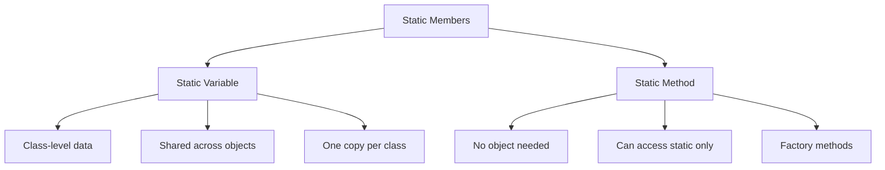

# Static Members

## Navigation

- Previous: [07 - Destructors](07-destructors.md)
- Next: [09 - Operator Overloading](09-operator-overloading.md)

---

## Overview

Static members belong to the class rather than to any specific object. They are shared across all objects of the class and can be accessed without creating an instance. Static members are useful for maintaining class-wide data and functionality.

---

## Explanation

### Static Variables

A static variable is shared among all objects of a class. It is initialized once and persists throughout the program.

```cpp
#include <iostream>
using namespace std;

class Counter {
private:
    int count;  // Instance variable
    static int totalCount;  // Static variable

public:
    Counter() {
        count = 0;
        totalCount++;
        cout << "Object created. Total objects: " << totalCount << endl;
    }

    ~Counter() {
        totalCount--;
        cout << "Object destroyed. Total objects: " << totalCount << endl;
    }

    void increment() {
        count++;
    }

    int getCount() {
        return count;
    }

    static int getTotalCount() {
        return totalCount;
    }
};

// Definition and initialization of static member
int Counter::totalCount = 0;

int main() {
    cout << "Initial total: " << Counter::getTotalCount() << endl;

    Counter c1;
    Counter c2;
    Counter c3;

    c1.increment();
    c1.increment();
    c2.increment();

    cout << "\nObject 1 count: " << c1.getCount() << endl;
    cout << "Object 2 count: " << c2.getCount() << endl;
    cout << "Object 3 count: " << c3.getCount() << endl;

    cout << "\nTotal objects: " << Counter::getTotalCount() << endl;

    return 0;
}
```

### Static Methods

Static methods belong to the class rather than to any object. They can be called without creating an object and can only access static members.

```cpp
#include <iostream>
using namespace std;

class MathUtils {
public:
    static int max(int a, int b) {
        return (a > b) ? a : b;
    }

    static int min(int a, int b) {
        return (a < b) ? a : b;
    }

    static int abs(int x) {
        return (x < 0) ? -x : x;
    }

    static double power(double base, int exp) {
        double result = 1.0;
        for (int i = 0; i < exp; i++) {
            result *= base;
        }
        return result;
    }
};

int main() {
    // Call static methods without creating object
    cout << "Max: " << MathUtils::max(10, 20) << endl;
    cout << "Min: " << MathUtils::min(10, 20) << endl;
    cout << "Abs: " << MathUtils::abs(-15) << endl;
    cout << "Power: " << MathUtils::power(2, 5) << endl;

    return 0;
}
```

### Static Class Variables

```cpp
#include <iostream>
using namespace std;

class Student {
private:
    string name;
    int id;
    static int nextId;  // Shared counter for IDs
    static int totalStudents;

public:
    Student(string n) : name(n) {
        id = nextId++;
        totalStudents++;
        cout << "Student created: " << name << " (ID: " << id << ")" << endl;
    }

    ~Student() {
        totalStudents--;
        cout << "Student removed: " << name << endl;
    }

    void display() {
        cout << "Name: " << name << ", ID: " << id << endl;
    }

    static int getTotalStudents() {
        return totalStudents;
    }
};

int Student::nextId = 1000;  // Start IDs from 1000
int Student::totalStudents = 0;

int main() {
    cout << "Initial students: " << Student::getTotalStudents() << endl;

    Student s1("Alice");
    Student s2("Bob");
    Student s3("Charlie");

    cout << "\nTotal students: " << Student::getTotalStudents() << endl;

    s1.display();
    s2.display();
    s3.display();

    return 0;
}
```

### Static Constants

```cpp
#include <iostream>
using namespace std;

class Configuration {
public:
    static const int MAX_USERS = 100;
    static const int MAX_CONNECTIONS = 50;
    static const string DEFAULT_THEME;

    static void displayLimits() {
        cout << "Max Users: " << MAX_USERS << endl;
        cout << "Max Connections: " << MAX_CONNECTIONS << endl;
        cout << "Default Theme: " << DEFAULT_THEME << endl;
    }
};

// Definition for static const string
const string Configuration::DEFAULT_THEME = "light";

int main() {
    Configuration::displayLimits();

    return 0;
}
```

### Singleton Pattern with Static

```cpp
#include <iostream>
using namespace std;

class Database {
private:
    static Database* instance;
    string connectionString;

    // Private constructor
    Database() {
        connectionString = "localhost:3306";
        cout << "Database connection established" << endl;
    }

public:
    static Database* getInstance() {
        if (instance == nullptr) {
            instance = new Database();
        }
        return instance;
    }

    void query(string sql) {
        cout << "Executing: " << sql << endl;
    }

    static void close() {
        if (instance != nullptr) {
            delete instance;
            instance = nullptr;
            cout << "Database connection closed" << endl;
        }
    }
};

Database* Database::instance = nullptr;

int main() {
    Database* db1 = Database::getInstance();
    Database* db2 = Database::getInstance();

    cout << "Same instance? " << (db1 == db2 ? "Yes" : "No") << endl;

    db1->query("SELECT * FROM users");
    db2->query("INSERT INTO users VALUES (1, 'John')");

    Database::close();

    return 0;
}
```

### Static Factory Method

```cpp
#include <iostream>
using namespace std;

class Shape {
private:
    string type;
    static int shapeCount;

    // Private constructor
    Shape(string t) : type(t) {
        shapeCount++;
    }

public:
    static Shape* createCircle(double radius) {
        return new Shape("Circle");
    }

    static Shape* createRectangle(double width, double height) {
        return new Shape("Rectangle");
    }

    static Shape* createTriangle(double base, double height) {
        return new Shape("Triangle");
    }

    ~Shape() {
        shapeCount--;
    }

    void display() {
        cout << "Shape type: " << type << endl;
    }

    static int getShapeCount() {
        return shapeCount;
    }
};

int Shape::shapeCount = 0;

int main() {
    cout << "Initial shapes: " << Shape::getShapeCount() << endl;

    Shape* s1 = Shape::createCircle(5.0);
    Shape* s2 = Shape::createRectangle(4.0, 6.0);
    Shape* s3 = Shape::createTriangle(3.0, 4.0);

    s1->display();
    s2->display();
    s3->display();

    cout << "\nTotal shapes: " << Shape::getShapeCount() << endl;

    delete s1;
    delete s2;
    delete s3;

    cout << "After deletion: " << Shape::getShapeCount() << endl;

    return 0;
}
```

---

## Visualization



---

## Advantages

| Advantage            | Description                        |
| -------------------- | ---------------------------------- |
| Class-level data     | Shared state across all objects    |
| No object needed     | Call methods without instantiation |
| Singleton pattern    | Control object creation            |
| Counters and configs | Track class-wide information       |

---

## Disadvantages

| Disadvantage       | Description                          |
| ------------------ | ------------------------------------ |
| Global state       | Can lead to coupling between objects |
| Testing difficulty | Hard to test in isolation            |
| Thread safety      | Need careful synchronization         |
| Memory persistence | Exists for entire program duration   |

---

## Common Mistakes

1. **Forgetting to define static member** - Linker error
2. **Accessing non-static from static** - Compilation error
3. **Using static for everything** - Poor design
4. **Not initializing static members** - Undefined behavior
5. **Thread safety issues** - Race conditions in multithreading

---

## Thinking Questions

1. What is the difference between static and instance variables?
2. Why can static methods only access static members?
3. What is the singleton pattern and when is it used?
4. How do you initialize static member variables?
5. Why are static members useful for counting objects?

---

## Practice Problems

1. Create a class that tracks how many objects have been created and destroyed.
2. Create a configuration class with static constants for app settings.
3. Implement a simple logger class that uses static methods.
4. Create a class that generates unique IDs using a static counter.
5. Implement a simple connection pool using static members.
