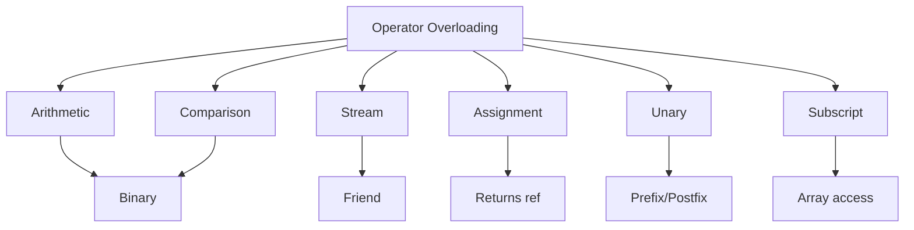

# Operator Overloading

## Navigation

- Previous: [08 - Static Members](08-static.md)
- Next: —

---

## Overview

Operator overloading allows you to redefine the behavior of built-in operators for user-defined types. This makes your classes work naturally with standard operators, improving code readability and expressiveness.

---

## Explanation

### Arithmetic Operators

```cpp
#include <iostream>
using namespace std;

class Complex {
private:
    double real;
    double imaginary;

public:
    Complex(double r = 0, double i = 0) : real(r), imaginary(i) {}

    // Overload +
    Complex operator+(const Complex& other) const {
        return Complex(real + other.real, imaginary + other.imaginary);
    }

    // Overload -
    Complex operator-(const Complex& other) const {
        return Complex(real - other.real, imaginary - other.imaginary);
    }

    // Overload *
    Complex operator*(const Complex& other) const {
        return Complex(
            real * other.real - imaginary * other.imaginary,
            real * other.imaginary + imaginary * other.real
        );
    }

    void display() const {
        cout << real;
        if (imaginary >= 0) cout << "+";
        cout << imaginary << "i" << endl;
    }
};

int main() {
    Complex c1(3, 2);
    Complex c2(1, 4);

    Complex sum = c1 + c2;
    Complex diff = c1 - c2;
    Complex prod = c1 * c2;

    cout << "c1: ";
    c1.display();

    cout << "c2: ";
    c2.display();

    cout << "c1 + c2: ";
    sum.display();

    cout << "c1 - c2: ";
    diff.display();

    cout << "c1 * c2: ";
    prod.display();

    return 0;
}
```

### Comparison Operators

```cpp
#include <iostream>
using namespace std;

class Fraction {
private:
    int numerator;
    int denominator;

public:
    Fraction(int n = 0, int d = 1) : numerator(n), denominator(d) {}

    // Overload ==
    bool operator==(const Fraction& other) const {
        return numerator * other.denominator ==
               other.numerator * denominator;
    }

    // Overload <
    bool operator<(const Fraction& other) const {
        return numerator * other.denominator <
               other.numerator * denominator;
    }

    // Overload >
    bool operator>(const Fraction& other) const {
        return numerator * other.denominator >
               other.numerator * denominator;
    }

    // Overload !=
    bool operator!=(const Fraction& other) const {
        return !(*this == other);
    }

    double toDecimal() const {
        return static_cast<double>(numerator) / denominator;
    }

    void display() const {
        cout << numerator << "/" << denominator;
    }
};

int main() {
    Fraction f1(1, 2);
    Fraction f2(2, 4);
    Fraction f3(3, 4);

    cout << "f1: ";
    f1.display();
    cout << " = " << f1.toDecimal() << endl;

    cout << "f2: ";
    f2.display();
    cout << " = " << f2.toDecimal() << endl;

    cout << "f3: ";
    f3.display();
    cout << " = " << f3.toDecimal() << endl;

    cout << "\nf1 == f2: " << (f1 == f2 ? "true" : "false") << endl;
    cout << "f1 < f3: " << (f1 < f3 ? "true" : "false") << endl;
    cout << "f3 > f1: " << (f3 > f1 ? "true" : "false") << endl;
    cout << "f1 != f3: " << (f1 != f3 ? "true" : "false") << endl;

    return 0;
}
```

### Stream Operators

```cpp
#include <iostream>
using namespace std;

class Point {
private:
    int x;
    int y;

public:
    Point(int x = 0, int y = 0) : x(x), y(y) {}

    // Friend function for <<
    friend ostream& operator<<(ostream& out, const Point& p) {
        out << "(" << p.x << ", " << p.y << ")";
        return out;
    }

    // Friend function for >>
    friend istream& operator>>(istream& in, Point& p) {
        cout << "Enter x and y: ";
        in >> p.x >> p.y;
        return in;
    }
};

int main() {
    Point p1(10, 20);
    Point p2;

    // Using << operator
    cout << "Point 1: " << p1 << endl;

    // Using >> operator
    cin >> p2;
    cout << "Point 2: " << p2 << endl;

    return 0;
}
```

### Assignment Operators

```cpp
#include <iostream>
using namespace std;

class String {
private:
    char* str;
    int length;

public:
    String(const char* s = "") {
        length = 0;
        while (s[length] != '\0') length++;
        str = new char[length + 1];
        for (int i = 0; i <= length; i++) {
            str[i] = s[i];
        }
    }

    // Copy constructor
    String(const String& other) {
        length = other.length;
        str = new char[length + 1];
        for (int i = 0; i <= length; i++) {
            str[i] = other.str[i];
        }
    }

    // Overload =
    String& operator=(const String& other) {
        if (this != &other) {
            delete[] str;
            length = other.length;
            str = new char[length + 1];
            for (int i = 0; i <= length; i++) {
                str[i] = other.str[i];
            }
        }
        return *this;
    }

    // Overload +=
    String& operator+=(const String& other) {
        char* newStr = new char[length + other.length + 1];
        for (int i = 0; i < length; i++) {
            newStr[i] = str[i];
        }
        for (int i = 0; i <= other.length; i++) {
            newStr[length + i] = other.str[i];
        }
        delete[] str;
        str = newStr;
        length += other.length;
        return *this;
    }

    void display() const {
        cout << str;
    }

    ~String() {
        delete[] str;
    }
};

int main() {
    String s1("Hello");
    String s2(" World");

    cout << "s1: ";
    s1.display();
    cout << endl;

    cout << "s2: ";
    s2.display();
    cout << endl;

    s1 += s2;

    cout << "s1 += s2: ";
    s1.display();
    cout << endl;

    return 0;
}
```

### Unary Operators

```cpp
#include <iostream>
using namespace std;

class Counter {
private:
    int value;

public:
    Counter(int v = 0) : value(v) {}

    // Overload ++ (prefix)
    Counter& operator++() {
        value++;
        return *this;
    }

    // Overload ++ (postfix)
    Counter operator++(int) {
        Counter temp = *this;
        value++;
        return temp;
    }

    // Overload -- (prefix)
    Counter& operator--() {
        value--;
        return *this;
    }

    // Overload -- (postfix)
    Counter operator--(int) {
        Counter temp = *this;
        value--;
        return temp;
    }

    // Overload - (unary minus)
    Counter operator-() const {
        return Counter(-value);
    }

    // Overload ! (logical not)
    bool operator!() const {
        return value == 0;
    }

    int getValue() const {
        return value;
    }
};

int main() {
    Counter c1(5);
    Counter c2(10);

    cout << "c1: " << c1.getValue() << endl;
    cout << "++c1: " << (++c1).getValue() << endl;
    cout << "c1++: " << (c1++).getValue() << endl;
    cout << "After c1++: " << c1.getValue() << endl;

    cout << "\n-c2: " << (-c2).getValue() << endl;
    cout << "!c1: " << (!c1 ? "true" : "false") << endl;

    Counter c3(0);
    cout << "!c3: " << (!c3 ? "true" : "false") << endl;

    return 0;
}
```

### Subscript Operator

```cpp
#include <iostream>
using namespace std;

class Array {
private:
    int arr[5];
    int size;

public:
    Array() : size(5) {
        for (int i = 0; i < size; i++) {
            arr[i] = 0;
        }
    }

    // Overload []
    int& operator[](int index) {
        if (index < 0 || index >= size) {
            cout << "Index out of bounds!" << endl;
            return arr[0];
        }
        return arr[index];
    }

    // Const version
    int operator[](int index) const {
        if (index < 0 || index >= size) {
            return 0;
        }
        return arr[index];
    }

    void display() const {
        for (int i = 0; i < size; i++) {
            cout << arr[i] << " ";
        }
        cout << endl;
    }
};

int main() {
    Array a;

    a[0] = 10;
    a[1] = 20;
    a[2] = 30;
    a[3] = 40;
    a[4] = 50;

    cout << "Array elements: ";
    a.display();

    cout << "a[2]: " << a[2] << endl;

    return 0;
}
```

---

## Visualization



---

## Advantages

| Advantage      | Description                       |
| -------------- | --------------------------------- |
| Natural syntax | Objects work like built-in types  |
| Readability    | Clearer than method calls         |
| Expressiveness | Intuitive operator usage          |
| Flexibility    | Customize behavior for your types |

---

## Disadvantages

| Disadvantage | Description                        |
| ------------ | ---------------------------------- |
| Complexity   | Can make code harder to understand |
| Overuse      | Should not overload without reason |
| Limitations  | Cannot create new operators        |
| Confusion    | May not match user expectations    |

---

## Common Mistakes

1. **Overloading for wrong types** - At least one operand must be user-defined
2. **Not returning reference** - Breaks chaining of operators
3. **Forgetting const correctness** - Should have const versions
4. **Not handling all cases** - Incomplete operator implementation
5. **Changing precedence** - Cannot change operator precedence

---

## Thinking Questions

1. What operators cannot be overloaded in C++?
2. Why should comparison operators be symmetric?
3. What is the difference between prefix and postfix ++?
4. Why are stream operators typically friend functions?
5. When should you overload the assignment operator?

---

## Practice Problems

1. Create a class `Matrix` (2x2) and overload + and \* operators.
2. Create a class `Date` and overload == and < operators.
3. Create a class `Vector` and overload + and - operators.
4. Create a class that overloads << for custom output.
5. Create a class that overloads [] for bounds-checked array access.
