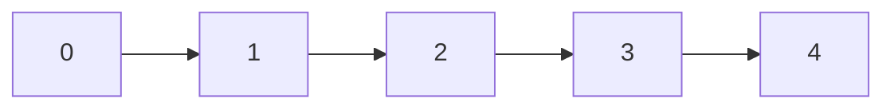
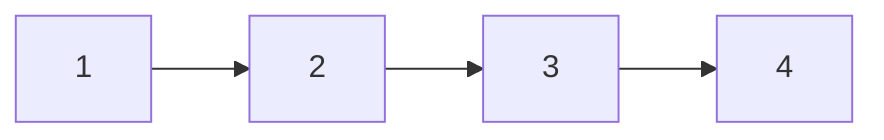
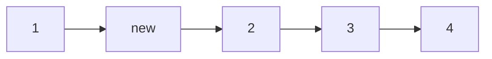

# Arrays in C++ (Advanced)
 
## Navigation

- Previous: —  
- Next: [Linked List](02-linked-list.md)  
- Task: [Task 1 - Arrays](../tasks/task1-arrays.md)

---

## Overview

An array is a linear data structure that stores elements of the same type in contiguous memory locations.

This allows:
- fast access  
- predictable memory layout  
- efficient iteration  

---

## Memory Representation



Each index maps directly to a memory address.

---

## How Access Works

```cpp
int arr[5] = {10, 20, 30, 40, 50};
cout << arr[2]; // 30
```

Access time:
```
O(1)
```

Because:
```
Address = Base + (index × size)
```

---

## Types of Arrays

### 1) Static Array

```cpp
int arr[5];
```

- fixed size  
- allocated at compile time  

---

### 2) Dynamic Array

```cpp
int* arr = new int[5];
```

- allocated at runtime  
- must be deleted manually  

---

## Operations

### Traversal

```cpp
for(int i = 0; i < 5; i++){
    cout << arr[i] << endl;
}
```

---

### Insertion (At Position)

```cpp
for(int i = n; i > pos; i--){
    arr[i] = arr[i-1];
}
arr[pos] = value;
```

---

### Deletion

```cpp
for(int i = pos; i < n-1; i++){
    arr[i] = arr[i+1];
}
```

---

## Time Complexity

| Operation | Complexity |
|----------|-----------|
| Access   | O(1)      |
| Search   | O(n)      |
| Insert   | O(n)      |
| Delete   | O(n)      |

---

## Why Insert/Delete is Slow?



Insert at index 1:



All elements must shift → O(n)

---

## Advantages

- Fast random access  
- Simple structure  
- Cache-friendly  

---

## Disadvantages

- Fixed size  
- Expensive insert/delete  
- Memory waste if unused  

---

## Common Mistakes

- Accessing out of bounds  
- Forgetting array size  
- Using uninitialized values  

---

## Advanced Concepts

### Prefix Sum (Important)

Used to answer range queries fast.

```cpp
int prefix[5];
prefix[0] = arr[0];

for(int i = 1; i < 5; i++){
    prefix[i] = prefix[i-1] + arr[i];
}
```

---

### Reverse Array

```cpp
for(int i = 0; i < n/2; i++){
    swap(arr[i], arr[n-i-1]);
}
```

---

## Comparison with Linked List

| Feature | Array | Linked List |
|--------|------|------------|
| Memory | contiguous | scattered |
| Access | O(1) | O(n) |
| Insert | O(n) | O(1) |
| Delete | O(n) | O(1) |

---

## Thinking Questions

- Why arrays are faster in access?  
- When should you avoid arrays?  
- What happens if array size is exceeded?  

---

## Apply What You Learned

 Solve: [Task 1 - Arrays](../tasks/task1-arrays.md)

---

## Next Lesson

 [Linked List](02-linked-list.md)

 ---

 Task: [Task 1 - Arrays](../tasks/task1-arrays.md)