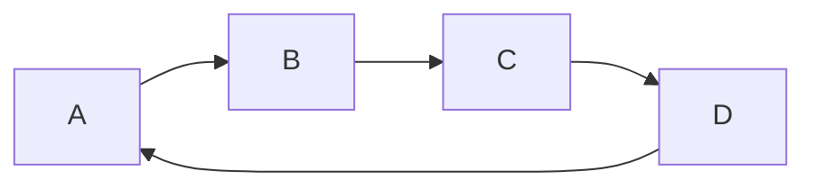
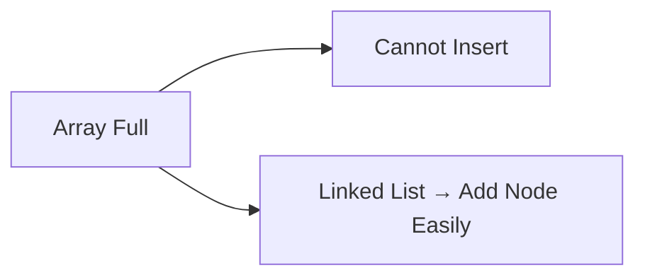

# Linked List in C++

## Navigation

- Previous: [Arrays](01-arrays.md)  
- Next: [Stack](03-stack.md)  
- Task: [Task 2 - Linked List](../tasks/task2-linked-list.md)

---

## Overview

A linked list is a linear data structure where elements are stored in nodes.

Each node contains:
- data  
- pointer to the next node  

Unlike arrays, elements are NOT stored in contiguous memory.

---

## Memory Representation


Each node points to the next node.

---

## Structure of Node

```cpp
struct Node {
    int data;
    Node* next;
};
```

---

## Creating Nodes

```cpp
Node* head = new Node{10, nullptr};
Node* second = new Node{20, nullptr};

head->next = second;
```

---

## Types of Linked Lists

### 1) Singly Linked List


- one direction  
- simple  

---

### 2) Doubly Linked List


- forward and backward  
- uses more memory  

---

### 3) Circular Linked List



- last node points to first  

---

## Traversal

```cpp
Node* temp = head;

while(temp != nullptr){
    cout << temp->data << endl;
    temp = temp->next;
}
```

---

## Insertion

### Insert at Beginning

```cpp
Node* newNode = new Node{5, head};
head = newNode;
```

---

### Insert at End

```cpp
Node* temp = head;

while(temp->next != nullptr){
    temp = temp->next;
}

temp->next = new Node{50, nullptr};
```

---

## Deletion

### Delete First Node

```cpp
Node* temp = head;
head = head->next;
delete temp;
```

---

### Delete by Value

```cpp
Node* temp = head;

while(temp->next->data != value){
    temp = temp->next;
}

Node* del = temp->next;
temp->next = del->next;
delete del;
```

---

## Time Complexity

| Operation | Complexity |
|----------|-----------|
| Access   | O(n)      |
| Search   | O(n)      |
| Insert   | O(1)      |
| Delete   | O(1)      |

---

## Why Linked List?



- dynamic size  
- efficient insertion/deletion  

---

## Advantages

- dynamic memory  
- fast insertion  
- no shifting  

---

## Disadvantages

- slow access  
- extra memory (pointers)  
- complex structure  

---

## Common Mistakes

- forgetting to update pointers  
- memory leaks (not deleting nodes)  
- accessing null pointer  

---

## Comparison with Array

| Feature | Array | Linked List |
|--------|------|------------|
| Memory | contiguous | scattered |
| Access | O(1) | O(n) |
| Insert | O(n) | O(1) |
| Delete | O(n) | O(1) |

---

## Advanced Thinking

- Why linked list is better for frequent insert/delete?  
- Why arrays are faster in access?  
- When should you use doubly linked list?  

---

## Apply What You Learned

 Solve: [Task 2 - Linked List](../tasks/task2-linked-list.md)

---

## Next Lesson

 [Stack](03-stack.md)
