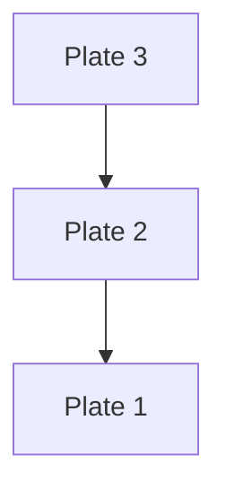
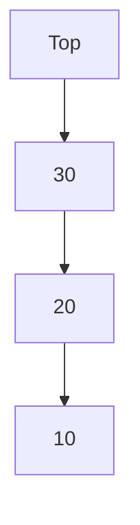
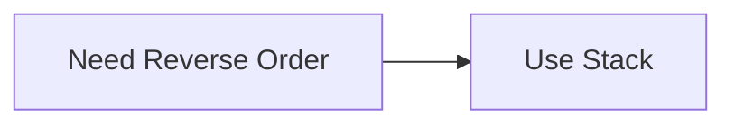

# Stack in C++

## Navigation

- Previous: [Linked List](02-linked-list.md)  
- Next: [Queue](04-queue.md)  
- Task: [Task 3 - Stack](../tasks/task3-stack.md)

---

## Overview

A stack is a linear data structure that follows the principle:

```
LIFO (Last In, First Out)
```

The last element added is the first to be removed.

---

## Real-World Analogy

Think of a stack of plates:



You always remove from the top.

---

## Core Operations

- push → add element  
- pop → remove element  
- peek → view top element  

---

## Stack Representation



---

## Implementation (Array)

```cpp
int stack[5];
int top = -1;
```

### Push

```cpp
if(top < 4){
    stack[++top] = value;
}
```

---

### Pop

```cpp
if(top >= 0){
    top--;
}
```

---

### Peek

```cpp
cout << stack[top];
```

---

## Implementation (Linked List)

```cpp
struct Node {
    int data;
    Node* next;
};

Node* top = nullptr;
```

### Push

```cpp
Node* newNode = new Node{value, top};
top = newNode;
```

---

### Pop

```cpp
Node* temp = top;
top = top->next;
delete temp;
```

---

## Time Complexity

| Operation | Complexity |
|----------|-----------|
| Push     | O(1)      |
| Pop      | O(1)      |
| Peek     | O(1)      |

---

## Why Stack?



---

## Common Use Cases

- undo/redo operations  
- parentheses checking  
- expression evaluation  
- recursion (call stack)  

---

## Example: Parentheses Validation

```cpp
bool isValid(string s){
    stack<char> st;

    for(char c : s){
        if(c == '(') st.push(c);
        else{
            if(st.empty()) return false;
            st.pop();
        }
    }

    return st.empty();
}
```

---

## Advantages

- simple structure  
- fast operations  
- useful in many algorithms  

---

## Disadvantages

- limited access (only top)  
- not flexible  

---

## Common Mistakes

- popping from empty stack  
- overflow in array implementation  
- forgetting to update top  

---

## Comparison

| Feature | Stack | Queue |
|--------|------|------|
| Order  | LIFO | FIFO |
| Access | top only | front/back |

---

## Thinking Questions

- Why stack is used in recursion?  
- What happens if stack overflows?  
- When should you NOT use stack?  

---

## Apply What You Learned

 Solve: [Task 3 - Stack](../tasks/task3-stack.md)

---

## Next Lesson

 [Queue](04-queue.md)