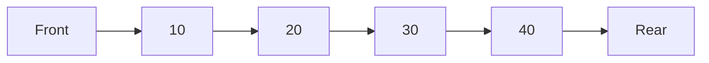
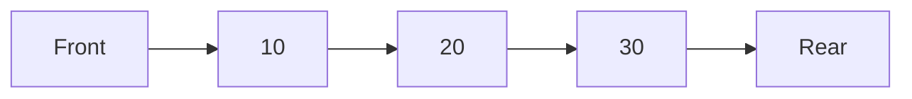
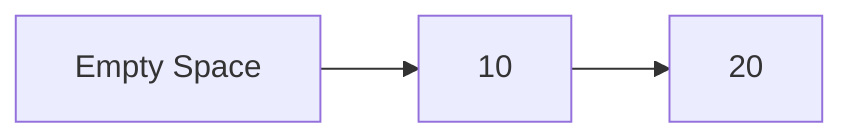
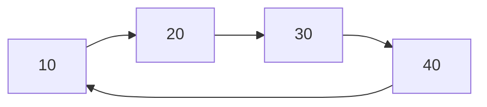
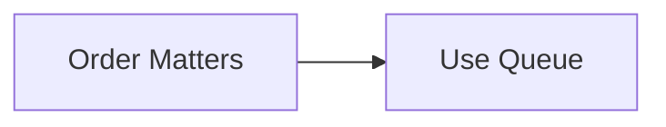

# Queue in C++

## Navigation

- Previous: [Stack](03-stack.md)  
- Next: [Deque](05-deque.md)  
- Task: [Task 4 - Queue](../tasks/task4-queue.md)

---

## Overview

A queue is a linear data structure that follows the principle:

```
FIFO (First In, First Out)
```

The first element added is the first to be removed.

---

## Real-World Analogy

Think of a queue in a line:



The first person in line is served first.

---

## Core Operations

- enqueue → add element (rear)  
- dequeue → remove element (front)  
- front → get first element  
- isEmpty → check if empty  

---

## Queue Representation



---

## Implementation (Array)

```cpp
int queue[5];
int front = 0;
int rear = -1;
```

---

### Enqueue

```cpp
if(rear < 4){
    queue[++rear] = value;
}
```

---

### Dequeue

```cpp
if(front <= rear){
    front++;
}
```

---

## Problem with Simple Queue



Even if space exists, it cannot be reused → inefficient.

---

## Circular Queue (Solution)



Reuse space using modulo.

---

### Circular Enqueue

```cpp
rear = (rear + 1) % size;
queue[rear] = value;
```

---

### Circular Dequeue

```cpp
front = (front + 1) % size;
```

---

## Implementation (Linked List)

```cpp
struct Node {
    int data;
    Node* next;
};

Node* front = nullptr;
Node* rear = nullptr;
```

---

### Enqueue

```cpp
Node* newNode = new Node{value, nullptr};

if(rear == nullptr){
    front = rear = newNode;
}
else{
    rear->next = newNode;
    rear = newNode;
}
```

---

### Dequeue

```cpp
Node* temp = front;
front = front->next;

if(front == nullptr){
    rear = nullptr;
}

delete temp;
```

---

## Time Complexity

| Operation | Complexity |
|----------|-----------|
| Enqueue  | O(1)      |
| Dequeue  | O(1)      |
| Front    | O(1)      |

---

## Why Queue?



---

## Common Use Cases

- CPU scheduling  
- task processing  
- BFS (graph traversal)  
- printing systems  

---

## Advantages

- maintains order  
- efficient operations  
- easy to implement  

---

## Disadvantages

- limited access  
- wasted space (simple queue)  

---

## Common Mistakes

- not checking empty queue  
- overflow in array  
- ignoring circular behavior  

---

## Comparison

| Feature | Queue | Stack |
|--------|------|------|
| Order  | FIFO | LIFO |
| Access | front/rear | top |

---

## Thinking Questions

- Why circular queue is better?  
- When should you use queue over stack?  
- What happens if queue is full?  

---

## Apply What You Learned

 Solve: [Task 4 - Queue](../tasks/task4-queue.md)

---

## Next Lesson

 [Deque](05-deque.md)