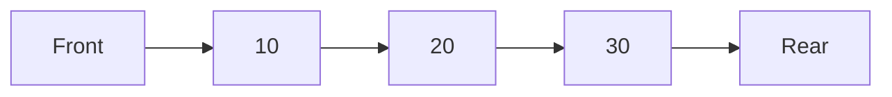
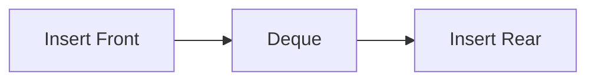
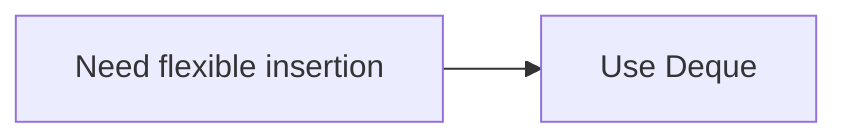

# Deque in C++

## Navigation

- Previous: [Queue](04-queue.md)  
- Next: — 
- Task: [Task 5 - Deque](../tasks/task5-deque.md)

---

## Overview

A deque (double-ended queue) is a linear data structure that allows insertion and deletion from both ends.

It combines features of:
- stack (LIFO)  
- queue (FIFO)  

---

## Representation



Unlike queue, both ends are accessible.

---

## Core Operations

- push_front → insert at front  
- push_back → insert at rear  
- pop_front → remove from front  
- pop_back → remove from rear  

---

## Deque Behavior



---

## Implementation (Array - Circular)

```cpp
int dq[5];
int front = -1;
int rear = -1;
```

---

### Push Front

```cpp
front = (front - 1 + size) % size;
dq[front] = value;
```

---

### Push Back

```cpp
rear = (rear + 1) % size;
dq[rear] = value;
```

---

### Pop Front

```cpp
front = (front + 1) % size;
```

---

### Pop Back

```cpp
rear = (rear - 1 + size) % size;
```

---

## Implementation (STL)

```cpp
#include <deque>

deque<int> dq;

dq.push_back(10);
dq.push_front(5);

dq.pop_back();
dq.pop_front();
```

---

## Time Complexity

| Operation   | Complexity |
|------------|-----------|
| push_front | O(1)      |
| push_back  | O(1)      |
| pop_front  | O(1)      |
| pop_back   | O(1)      |

---

## Why Deque?



---

## Use Cases

- sliding window problems  
- palindrome checking  
- undo/redo (advanced)  
- caching systems  

---

## Advantages

- flexible operations  
- efficient  
- supports both ends  

---

## Disadvantages

- more complex than stack/queue  
- harder to implement manually  

---

## Comparison

| Feature | Stack | Queue | Deque |
|--------|------|------|------|
| Insert | one side | one side | both sides |
| Remove | one side | one side | both sides |

---

## Common Mistakes

- wrong circular indexing  
- confusion between front/rear  
- not handling empty case  

---

## Thinking Questions

- When should you use deque instead of queue?  
- Why deque is useful in sliding window?  
- Can deque replace stack and queue?  

---

## Apply What You Learned

 Solve: [Task 5 - Deque](../tasks/task5-deque.md)

---

