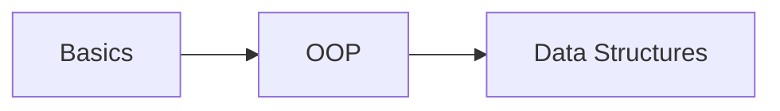
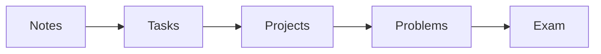

<div align="center">

# C++ Roadmap

### From Zero to Data Structures — Structured, No Fluff

[](https://isocpp.org/)
[](#)
[](#)
[](LICENSE)

> A structured learning system — not just a collection of files.

</div>

---

## Overview

This repository is a structured roadmap to learn C++ from beginner level to a solid understanding of programming and data structures.

The goal is simple:

- learn concepts
- apply them
- build real systems
- develop problem solving skills

---

## Learning Path



---

## Learning Flow



Each level follows the same sequence. Do not skip steps.

---

## Start Learning

| Level | Module                      | Link                                       |
| ----- | --------------------------- | ------------------------------------------ |
| 1     | Basics                      | [01-Basics/](01-Basics/README.md)                   |
| 2     | Object-Oriented Programming | [02-OOP/](02-OOP/README.md)                         |
| 3     | Data Structures             | [03-Data-Structures/](03-Data-Structures/README.md) |

---

## Levels

### Level 01 — Basics

Start here:

[01-Basics/notes/](01-Basics/notes/)

You will learn:

- variables and types
- conditions
- loops
- arrays
- functions
- input/output
- strings
- pointers
- references
- type casting
- enums and structs

---

### Level 02 — Object-Oriented Programming

[02-OOP/](02-OOP/notes/)

You will learn:

- classes and objects
- encapsulation
- inheritance
- polymorphism
- abstraction
- constructors
- destructors
- static members
- operator overloading

---

### Level 03 — Data Structures

[03-Data-Structures/](03-Data-Structures/notes/)

You will learn:

- arrays (advanced techniques)
- linked lists (singly, doubly, circular)
- stack and queue (array & linked implementation)
- deque (double-ended queue)

You will also:

- analyze time and space complexity
- choose the right data structure for each problem
- build efficient and scalable solutions

---

## Navigation Guide

If you are starting from zero, follow this order:

1. [01-Basics/notes/](01-Basics/notes/)
2. [01-Basics/tasks/](01-Basics/tasks/)
3. [01-Basics/projects/](01-Basics/projects/)
4. [01-Basics/problems/](01-Basics/problems/)
5. [01-Basics/exam.md](01-Basics/exam.md)

Then move to:

- [02-OOP/](02-OOP/)
- [03-Data-Structures/](03-Data-Structures/)

---

## Repository Structure

```
cpp-roadmap/
|
├── 01-Basics/
│   ├── notes/
│   │   ├── 01-variables.md
│   │   ├── 02-if-else.md
│   │   ├── 03-loops.md
│   │   ├── 04-arrays.md
│   │   ├── 05-functions.md
│   │   ├── 06-input-output.md
│   │   ├── 07-strings.md
│   │   ├── 08-pointers.md
│   │   ├── 09-references.md
│   │   ├── 10-type-casting.md
│   │   └── 11-enums-structs.md
│   │
│   ├── tasks/
│   │   ├── task1-variables.md
│   │   ├── task2-if.md
│   │   ├── task3-loops.md
│   │   ├── task4-arrays.md
│   │   ├── task5-functions.md
│   │   ├── task6-io.md
│   │   ├── task7-strings.md
│   │   ├── task8-pointers.md
│   │   ├── task9-references.md
│   │   ├── task10-casting.md
│   │   └── task11-enums-structs.md
│   │
│   ├── projects/
│   │   ├── calculator/
│   │   ├── guessing-game/
│   │   ├── login-system/
│   │   └── binary-to-decimal/
│   │
│   ├── problems/
│   │   ├── easy.md
│   │   └── medium.md
│   │
│   └── exam.md
│
├── 02-OOP/
│   ├── notes/
│   │   ├── 01-classes.md
│   │   ├── 02-encapsulation.md
│   │   ├── 03-inheritance.md
│   │   ├── 04-polymorphism.md
│   │   ├── 05-abstraction.md
│   │   ├── 06-constructors.md
│   │   ├── 07-destructors.md
│   │   ├── 08-static.md
│   │   └── 09-operator-overloading.md
│   │
│   ├── tasks/
│   │   ├── task1-classes.md
│   │   ├── task2-encapsulation.md
│   │   ├── task3-inheritance.md
│   │   ├── task4-polymorphism.md
│   │   ├── task5-abstraction.md
│   │   ├── task6-constructors.md
│   │   ├── task7-destructors.md
│   │   ├── task8-static.md
│   │   └── task9-operator-overloading.md
│   │
│   ├── projects/
│   │   ├── student-system/
│   │   └── bank-system/
│   │
│   ├── problems/
│   │   ├── easy.md
│   │   └── medium.md
│   │
│   └── exam.md
│
├── 03-Data-Structures/
│   ├── notes/
│   │   ├── 01-arrays.md
│   │   ├── 02-linked-list.md
│   │   ├── 03-stack.md
│   │   ├── 04-queue.md
│   │   └── 05-deque.md
│   │
│   ├── tasks/
│   │   ├── task1-arrays.md
│   │   ├── task2-linked-list.md
│   │   ├── task3-stack.md
│   │   ├── task4-queue.md
│   │   └── task5-deque.md
│   │
│   ├── projects/
│   │   ├── array-toolkit/
│   │   ├── linked-list-manager/
│   │   ├── stack-implementation/
│   │   └── queue-system/
│   │
│   ├── problems/
│   │   ├── easy.md
│   │   ├── medium.md
│   │   └── hard.md
│   │
│   └── exam.md
│
├── LICENSE
├── .gitignore
└── README.md
```

---

## Quick Start

Start directly:

[01-Basics/notes/01-variables.md](01-Basics/notes/01-variables.md)

---

## Rules

- Do not skip steps
- Do not copy without understanding
- Practice daily
- Focus on logic

---

## About

Created by [Mohamed Kotb](https://github.com/mohamedxk9tb)

This repository is designed as a structured path for serious learners.
